# Data Flow Architecture Documentation
## Plume Navigation Simulation System

**Document Version:** 1.0.0  
**Last Updated:** 2024-01-15  
**Document Type:** Architecture Documentation  
**Target Audience:** Software Architects, System Engineers, Research Scientists, Algorithm Developers

---

## Table of Contents

1. [Executive Summary](#executive-summary)
2. [System Overview](#system-overview)
3. [Data Flow Architecture](#data-flow-architecture)
4. [Multi-Level Caching Architecture](#multi-level-caching-architecture)
5. [Cross-Format Data Processing Pipeline](#cross-format-data-processing-pipeline)
6. [Batch Processing Data Flow](#batch-processing-data-flow)
7. [Scientific Computing Data Transformations](#scientific-computing-data-transformations)
8. [Performance Analysis Data Flow](#performance-analysis-data-flow)
9. [Error Handling and Recovery](#error-handling-and-recovery)
10. [Performance Targets and Metrics](#performance-targets-and-metrics)

---

## Executive Summary

This document provides comprehensive documentation of the data flow architecture for the plume navigation simulation system. The system processes raw video input through normalization, simulation execution, analysis, and result output phases while maintaining strict performance requirements of processing 4000+ simulations within 8-hour target timeframes with >95% correlation accuracy and >0.99 reproducibility requirements.

### Key Architectural Principles

- **Modular Component Design**: Separation of data processing, simulation execution, and analysis phases
- **Multi-Level Caching**: Three-tier caching strategy for optimal performance
- **Cross-Format Compatibility**: Unified processing interface for multiple data formats
- **Batch Processing Optimization**: Parallel vs serial task differentiation
- **Scientific Computing Rigor**: Statistical validation and reproducible transformations

---

## System Overview

### High-Level Data Flow

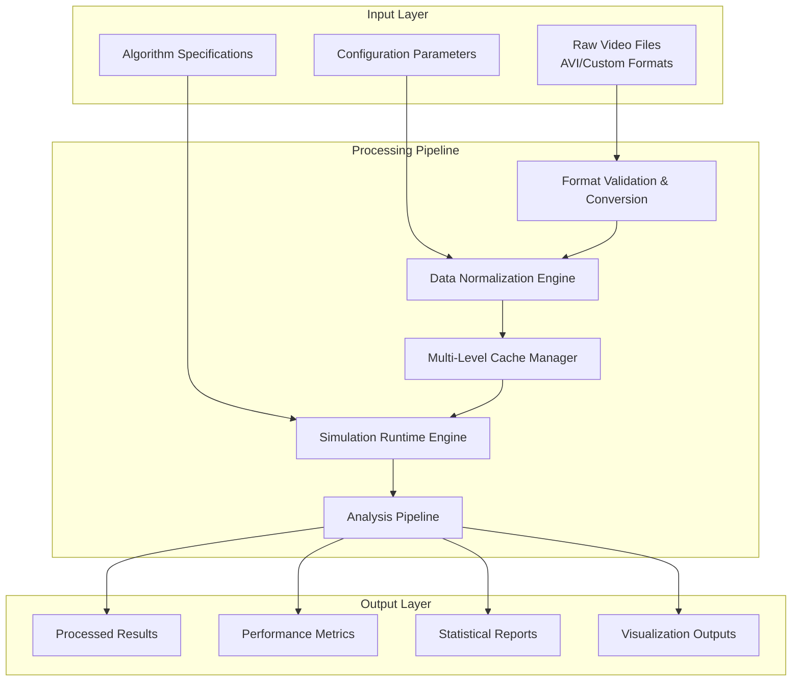

### System Performance Targets

| Metric | Target Value | Measurement Method |
|--------|--------------|-------------------|
| Simulation Time | 7.2 seconds average | Automated timing per simulation |
| Batch Completion | 8.0 hours maximum | Total processing time for 4000+ simulations |
| Correlation Accuracy | >95% | Statistical validation against benchmarks |
| Reproducibility | >0.99 threshold | Cross-platform result consistency |
| Cache Hit Rate | >80% | Cache utilization monitoring |

---

## Data Flow Architecture

### Primary Data Processing Stages

#### Stage 1: Data Ingestion and Validation

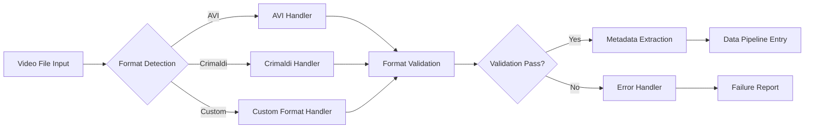

**Data Validation Criteria:**
- File integrity verification (checksum validation)
- Format compatibility assessment
- Resolution and frame rate validation
- Temporal sampling rate verification
- Intensity unit consistency checks

#### Stage 2: Data Normalization and Standardization

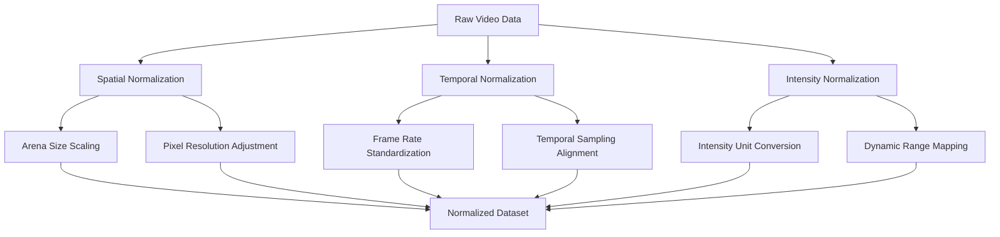

**Normalization Parameters:**
- **Spatial**: Arena dimensions, pixel-to-physical unit ratios, coordinate system alignment
- **Temporal**: Frame rate standardization, timestamp synchronization, sampling interval normalization
- **Intensity**: Unit conversion algorithms, dynamic range mapping, calibration factor application

#### Stage 3: Simulation Execution Pipeline

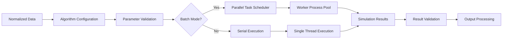

---

## Multi-Level Caching Architecture

### Cache Hierarchy Design

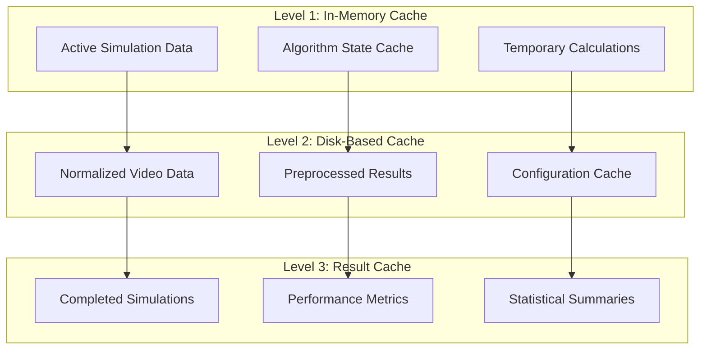

### Cache Management Strategies

#### Level 1: In-Memory Caching (RAM)
- **Purpose**: High-speed access to active simulation data
- **Storage Capacity**: 2-4 GB typical allocation
- **Data Types**: Current video frames, algorithm state variables, intermediate calculations
- **Eviction Policy**: LRU (Least Recently Used) with simulation priority weighting
- **Cache Keys**: Simulation ID + timestamp + data type identifier

```
Cache Structure:
├── simulation_data/
│   ├── {simulation_id}/
│   │   ├── current_frame_data
│   │   ├── algorithm_state
│   │   └── intermediate_results
│   └── shared_cache/
│       ├── algorithm_configurations
│       └── common_calculations
```

#### Level 2: Disk-Based Caching (SSD/HDD)
- **Purpose**: Persistent storage of normalized video data
- **Storage Capacity**: 50-200 GB allocation based on dataset size
- **Data Types**: Normalized video files, preprocessed metadata, calibration parameters
- **File Organization**: Hierarchical directory structure with content-based naming
- **Compression**: Lossless compression for video data preservation

```
Disk Cache Structure:
├── normalized_videos/
│   ├── {video_hash}/
│   │   ├── normalized_data.npz
│   │   ├── metadata.json
│   │   └── calibration_params.json
│   └── preprocessing_cache/
│       ├── format_conversions/
│       └── validation_results/
```

#### Level 3: Result Caching (Archive Storage)
- **Purpose**: Long-term storage of completed simulation results
- **Storage Capacity**: Unlimited growth with archival policies
- **Data Types**: Final simulation outputs, performance metrics, statistical analyses
- **Retention Policy**: Configurable retention periods with automated cleanup
- **Index Structure**: Searchable metadata for rapid result retrieval

```
Result Cache Structure:
├── simulation_results/
│   ├── {batch_id}/
│   │   ├── individual_results/
│   │   ├── batch_summary.json
│   │   └── performance_metrics.csv
│   └── statistical_analyses/
│       ├── correlation_data/
│       └── comparative_studies/
```

### Cache Performance Optimization

#### Cache Hit Rate Optimization
- **Target**: >80% overall cache hit rate
- **Monitoring**: Real-time cache performance metrics
- **Adaptive Sizing**: Dynamic cache allocation based on usage patterns
- **Predictive Prefetching**: Algorithm-based prediction of likely cache requests

#### Cache Coherency Management
- **Consistency Models**: Write-through for critical data, write-back for performance optimization
- **Invalidation Strategies**: Time-based expiration with manual override capabilities
- **Synchronization**: Cross-level cache synchronization during batch operations

---

## Cross-Format Data Processing Pipeline

### Format Detection and Classification

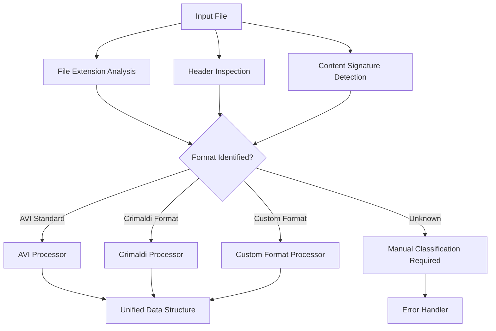

### Format-Specific Processing Modules

#### AVI Format Handler
```
Processing Steps:
1. Container validation (AVI/RIFF structure)
2. Codec identification and compatibility check
3. Frame extraction and temporal analysis
4. Metadata parsing (duration, frame rate, resolution)
5. Conversion to standardized numpy arrays
```

#### Crimaldi Format Handler
```
Processing Steps:
1. Custom header parsing
2. Proprietary compression decompression
3. Calibration parameter extraction
4. Physical unit conversion
5. Spatial coordinate system normalization
```

#### Custom Format Handler
```
Processing Steps:
1. Format specification lookup
2. Plugin-based decoder invocation
3. Data structure validation
4. Quality assessment and filtering
5. Standardization pipeline application
```

### Unified Data Structure

```python
# Standardized data format across all input types
normalized_data = {
    'video_data': np.ndarray,          # Shape: (time, height, width, channels)
    'metadata': {
        'original_format': str,         # Source format identifier
        'resolution': tuple,            # (width, height) in pixels
        'frame_rate': float,            # Frames per second
        'duration': float,              # Total duration in seconds
        'physical_scale': dict,         # Physical dimension mappings
        'intensity_units': str,         # Measurement units
        'calibration_params': dict      # Format-specific calibrations
    },
    'quality_metrics': {
        'data_integrity': float,        # Validation score (0-1)
        'processing_confidence': float, # Conversion confidence (0-1)
        'temporal_consistency': float   # Frame-to-frame consistency (0-1)
    }
}
```

---

## Batch Processing Data Flow

### Batch Execution Architecture

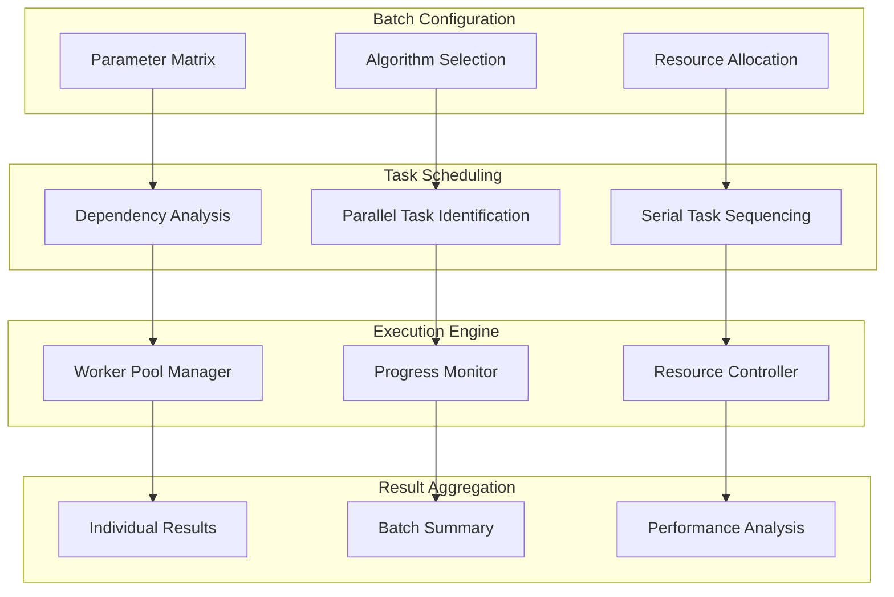

### Parallel vs Serial Task Differentiation

#### Parallel Processing Tasks
- **Independent Simulations**: Different parameter combinations on same dataset
- **Multi-Algorithm Comparison**: Same parameters across different algorithms
- **Cross-Validation Runs**: Statistical validation across data subsets
- **Format Processing**: Simultaneous handling of multiple input files

```python
# Parallel task characteristics
parallel_tasks = {
    'independence': True,           # No shared state dependencies
    'isolation': True,             # Separate memory spaces
    'resource_bounded': True,      # CPU/memory limitations respected
    'fault_tolerance': True        # Individual failure isolation
}
```

#### Serial Processing Requirements
- **Data Normalization**: Sequential processing maintaining data integrity
- **Cache Management**: Coordinated cache updates and invalidation
- **Result Aggregation**: Sequential compilation of batch results
- **Quality Validation**: Systematic validation across completed simulations

```python
# Serial task characteristics
serial_tasks = {
    'state_dependency': True,      # Shared state requirements
    'ordering_critical': True,     # Execution sequence matters
    'resource_coordination': True, # Synchronized resource access
    'error_propagation': True      # Failure impacts downstream tasks
}
```

### Batch Performance Optimization

#### Dynamic Load Balancing
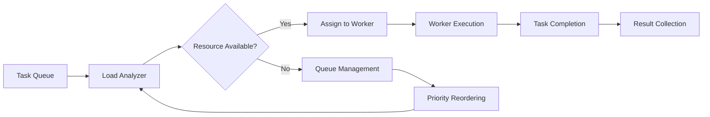

**Load Balancing Strategies:**
- **CPU-based allocation**: Task distribution based on computational complexity
- **Memory-aware scheduling**: Prevention of memory exhaustion through intelligent queuing
- **I/O optimization**: Coordination of disk-intensive operations
- **Adaptive scaling**: Dynamic worker pool sizing based on system performance

#### Progress Monitoring and Reporting

```
Real-time Progress Display:
┌─ Batch Execution Status ─────────────────────────────────┐
│                                                          │
│ Total Simulations: 4000                                  │
│ Completed: 2847 (71.2%)                                  │
│ Running: 16                                              │
│ Queued: 1137                                             │
│ Failed: 0                                                │
│                                                          │
│ Average Time: 6.8s/simulation                            │
│ Estimated Completion: 2.3 hours remaining                │
│ Cache Hit Rate: 84.2%                                    │
│                                                          │
│ ████████████████████████████░░░░░░░░░░░ 71.2%            │
│                                                          │
└──────────────────────────────────────────────────────────┘
```

---

## Scientific Computing Data Transformations

### Numerical Processing Pipeline

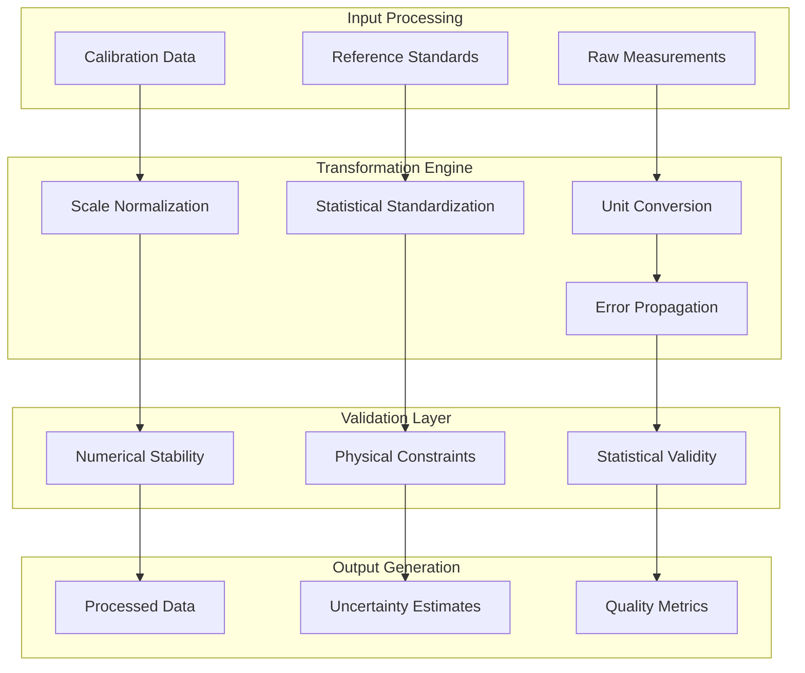

### Data Transformation Categories

#### Spatial Transformations
```python
# Arena size normalization
def normalize_arena_dimensions(video_data, physical_scale):
    """
    Normalizes video data to standard arena dimensions
    maintaining physical accuracy and spatial relationships
    """
    target_arena_size = (1.0, 1.0)  # Standard normalized dimensions
    scale_factor = calculate_scale_factor(physical_scale, target_arena_size)
    
    return {
        'normalized_video': apply_spatial_scaling(video_data, scale_factor),
        'coordinate_transform': generate_coordinate_mapping(scale_factor),
        'scale_metadata': {
            'original_scale': physical_scale,
            'normalization_factor': scale_factor,
            'target_dimensions': target_arena_size
        }
    }
```

#### Temporal Transformations
```python
# Frame rate standardization
def standardize_temporal_resolution(video_data, original_fps, target_fps=30.0):
    """
    Standardizes temporal resolution across different recording systems
    preserving temporal dynamics and motion characteristics
    """
    resampling_factor = target_fps / original_fps
    
    if resampling_factor > 1.0:
        # Interpolation for upsampling
        return temporal_interpolation(video_data, resampling_factor)
    elif resampling_factor < 1.0:
        # Decimation for downsampling
        return temporal_decimation(video_data, resampling_factor)
    else:
        # No transformation needed
        return video_data
```

#### Intensity Transformations
```python
# Dynamic range normalization
def normalize_intensity_range(video_data, calibration_params):
    """
    Normalizes intensity values across different measurement systems
    maintaining physical meaning and measurement accuracy
    """
    # Extract calibration parameters
    offset = calibration_params.get('intensity_offset', 0.0)
    scale = calibration_params.get('intensity_scale', 1.0)
    units = calibration_params.get('units', 'arbitrary')
    
    # Apply calibration transformation
    calibrated_data = (video_data - offset) * scale
    
    # Normalize to standard range [0, 1]
    normalized_data = (calibrated_data - calibrated_data.min()) / \
                     (calibrated_data.max() - calibrated_data.min())
    
    return {
        'normalized_intensities': normalized_data,
        'calibration_applied': calibration_params,
        'dynamic_range': (calibrated_data.min(), calibrated_data.max())
    }
```

### Statistical Validation Framework

#### Correlation Analysis
```python
# Statistical validation against reference implementations
def validate_simulation_accuracy(results, reference_data, threshold=0.95):
    """
    Validates simulation results against reference implementations
    ensuring >95% correlation accuracy requirement
    """
    correlations = []
    
    for metric in ['trajectory_similarity', 'time_to_target', 'search_efficiency']:
        correlation = calculate_correlation(
            results[metric], 
            reference_data[metric]
        )
        correlations.append(correlation)
    
    overall_correlation = np.mean(correlations)
    
    return {
        'overall_correlation': overall_correlation,
        'individual_correlations': dict(zip(
            ['trajectory_similarity', 'time_to_target', 'search_efficiency'], 
            correlations
        )),
        'passes_threshold': overall_correlation >= threshold,
        'validation_timestamp': datetime.now().isoformat()
    }
```

#### Reproducibility Assessment
```python
# Cross-platform reproducibility validation
def assess_reproducibility(results_set_1, results_set_2, threshold=0.99):
    """
    Assesses reproducibility of results across different computational environments
    ensuring >0.99 reproducibility threshold requirement
    """
    reproducibility_scores = []
    
    for key in results_set_1.keys():
        if key in results_set_2:
            score = calculate_reproducibility_score(
                results_set_1[key], 
                results_set_2[key]
            )
            reproducibility_scores.append(score)
    
    overall_reproducibility = np.mean(reproducibility_scores)
    
    return {
        'reproducibility_score': overall_reproducibility,
        'meets_threshold': overall_reproducibility >= threshold,
        'detailed_scores': reproducibility_scores,
        'assessment_metadata': {
            'comparison_timestamp': datetime.now().isoformat(),
            'threshold_used': threshold
        }
    }
```

---

## Performance Analysis Data Flow

### Real-Time Performance Monitoring

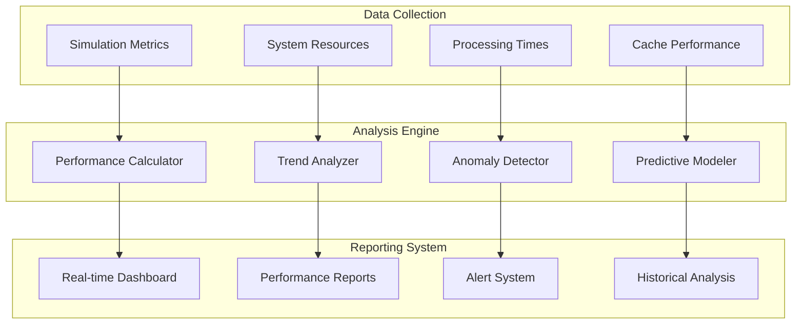

### Performance Metric Categories

#### Navigation Algorithm Performance
```python
# Comprehensive algorithm performance analysis
performance_metrics = {
    'navigation_success': {
        'source_localization_rate': float,      # Percentage of successful localizations
        'time_to_target': float,                # Average time to reach source
        'path_efficiency': float,               # Ratio of direct to actual path length
        'search_pattern_quality': float         # Effectiveness of search strategy
    },
    'robustness_analysis': {
        'performance_variance': float,          # Consistency across different conditions
        'error_resilience': float,              # Recovery from navigation errors
        'environmental_adaptability': float     # Performance across different environments
    },
    'temporal_dynamics': {
        'response_latency': float,              # Time to respond to plume encounters
        'adaptation_speed': float,              # Speed of strategy adjustment
        'decision_frequency': float             # Rate of navigation decisions
    }
}
```

#### System Performance Monitoring
```python
# Real-time system performance tracking
system_metrics = {
    'processing_performance': {
        'simulation_throughput': float,         # Simulations per hour
        'average_processing_time': float,       # Seconds per simulation
        'batch_completion_rate': float,         # Percentage of on-time completions
        'resource_utilization': dict           # CPU, memory, disk usage
    },
    'cache_efficiency': {
        'hit_rate_l1': float,                  # Level 1 cache hit rate
        'hit_rate_l2': float,                  # Level 2 cache hit rate
        'hit_rate_l3': float,                  # Level 3 cache hit rate
        'cache_eviction_rate': float           # Rate of cache evictions
    },
    'data_quality': {
        'validation_pass_rate': float,          # Percentage of data passing validation
        'format_conversion_success': float,     # Success rate of format conversions
        'numerical_stability': float           # Stability of numerical computations
    }
}
```

### Statistical Comparison Framework

#### Algorithm Comparison Analysis
```python
def generate_comparative_analysis(algorithm_results):
    """
    Generates comprehensive statistical comparison between algorithms
    supporting research validation and algorithm development feedback
    """
    comparison_report = {
        'statistical_tests': {
            'anova_results': perform_anova_analysis(algorithm_results),
            'post_hoc_tests': perform_post_hoc_analysis(algorithm_results),
            'effect_sizes': calculate_effect_sizes(algorithm_results)
        },
        'performance_rankings': {
            'overall_ranking': rank_algorithms_overall(algorithm_results),
            'metric_specific_rankings': rank_by_metrics(algorithm_results),
            'statistical_significance': assess_significance(algorithm_results)
        },
        'visualization_data': {
            'trajectory_plots': generate_trajectory_visualizations(algorithm_results),
            'performance_distributions': create_distribution_plots(algorithm_results),
            'comparative_charts': build_comparison_charts(algorithm_results)
        }
    }
    
    return comparison_report
```

#### Cross-Environment Analysis
```python
def analyze_cross_environment_performance(crimaldi_results, custom_results):
    """
    Analyzes algorithm performance across Crimaldi and custom plume environments
    providing insights into algorithm robustness and environmental adaptability
    """
    cross_analysis = {
        'environment_effects': {
            'crimaldi_performance': summarize_performance(crimaldi_results),
            'custom_performance': summarize_performance(custom_results),
            'performance_delta': calculate_performance_difference(
                crimaldi_results, custom_results
            )
        },
        'adaptability_metrics': {
            'consistency_score': calculate_consistency_across_environments(
                crimaldi_results, custom_results
            ),
            'robustness_index': compute_robustness_index(
                crimaldi_results, custom_results
            ),
            'transferability': assess_algorithm_transferability(
                crimaldi_results, custom_results
            )
        },
        'recommendations': {
            'optimization_opportunities': identify_optimization_areas(
                crimaldi_results, custom_results
            ),
            'environment_specific_tuning': suggest_environment_tuning(
                crimaldi_results, custom_results
            )
        }
    }
    
    return cross_analysis
```

---

## Error Handling and Recovery

### Comprehensive Error Management

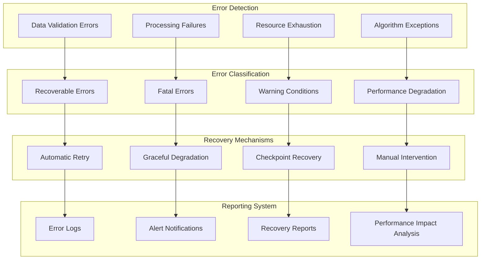

### Error Recovery Strategies

#### Fail-Fast Validation
```python
def validate_input_data(video_file, configuration):
    """
    Early detection and reporting of incompatible data formats,
    missing calibration parameters, or invalid algorithm configurations
    """
    validation_results = {
        'file_integrity': check_file_integrity(video_file),
        'format_compatibility': validate_format_compatibility(video_file),
        'configuration_validity': validate_configuration(configuration),
        'resource_availability': check_resource_requirements(video_file, configuration)
    }
    
    # Fail fast on critical validation failures
    for check, result in validation_results.items():
        if not result['passed']:
            raise ValidationError(f"Validation failed: {check} - {result['message']}")
    
    return validation_results
```

#### Graceful Degradation
```python
def handle_partial_batch_failure(batch_results, failed_simulations):
    """
    Partial batch processing completion with detailed reporting of
    successful and failed simulations, enabling recovery and continuation
    """
    recovery_plan = {
        'successful_simulations': len([r for r in batch_results if r['status'] == 'completed']),
        'failed_simulations': len(failed_simulations),
        'partial_results': extract_partial_results(batch_results),
        'recovery_options': {
            'retry_failed': prepare_retry_batch(failed_simulations),
            'continue_with_partial': assess_partial_completeness(batch_results),
            'manual_review_required': identify_manual_intervention_needs(failed_simulations)
        }
    }
    
    return recovery_plan
```

#### Checkpoint-Based Recovery
```python
def implement_checkpoint_recovery(batch_id, checkpoint_interval=100):
    """
    Automatic retry logic for transient failures and checkpoint-based
    resumption for long-running batch operations
    """
    checkpoint_system = {
        'checkpoint_frequency': checkpoint_interval,
        'recovery_points': load_available_checkpoints(batch_id),
        'resume_capability': assess_resume_capability(batch_id),
        'data_integrity': validate_checkpoint_integrity(batch_id)
    }
    
    if checkpoint_system['resume_capability']:
        return resume_from_checkpoint(batch_id, checkpoint_system['recovery_points'][-1])
    else:
        return restart_batch_with_checkpointing(batch_id, checkpoint_interval)
```

---

## Performance Targets and Metrics

### System Performance Monitoring

#### Real-Time Performance Dashboard
```
┌─ System Performance Dashboard ─────────────────────────────────────┐
│                                                                    │
│ Simulation Performance:                                             │
│ ├─ Average Time: 6.8s/simulation (Target: 7.2s) ✓                 │
│ ├─ Batch Progress: 71.2% (2847/4000)                              │
│ ├─ Estimated Completion: 2.3 hours (Target: 8.0 hours) ✓          │
│ └─ Correlation Accuracy: 96.3% (Target: >95%) ✓                   │
│                                                                    │
│ Cache Performance:                                                  │
│ ├─ L1 Hit Rate: 92.1% (Target: >80%) ✓                           │
│ ├─ L2 Hit Rate: 84.7% (Target: >80%) ✓                           │
│ ├─ L3 Hit Rate: 78.3% (Target: >80%) ✗                           │
│ └─ Overall Hit Rate: 84.2% (Target: >80%) ✓                      │
│                                                                    │
│ System Resources:                                                   │
│ ├─ CPU Usage: 78.4% (16/16 cores active)                          │
│ ├─ Memory Usage: 12.3GB/32GB (38.4%)                              │
│ ├─ Disk I/O: 145 MB/s read, 67 MB/s write                         │
│ └─ Network: Minimal (local processing)                             │
│                                                                    │
│ Quality Metrics:                                                    │
│ ├─ Reproducibility Score: 0.994 (Target: >0.99) ✓                │
│ ├─ Data Validation Pass Rate: 99.7%                               │
│ ├─ Format Conversion Success: 100%                                 │
│ └─ Numerical Stability: 99.9%                                      │
│                                                                    │
└────────────────────────────────────────────────────────────────────┘
```

#### Performance Trend Analysis
```python
# Long-term performance trend monitoring
performance_trends = {
    'simulation_time_trend': {
        'current_average': 6.8,
        'target': 7.2,
        'trend_direction': 'improving',
        'variance': 0.3,
        'historical_data': list  # Time series of performance measurements
    },
    'accuracy_trend': {
        'current_correlation': 0.963,
        'target': 0.95,
        'trend_direction': 'stable',
        'confidence_interval': (0.951, 0.975),
        'historical_data': list  # Time series of accuracy measurements
    },
    'resource_utilization_trend': {
        'cpu_efficiency': 0.784,
        'memory_efficiency': 0.384,
        'cache_efficiency': 0.842,
        'trend_analysis': dict  # Resource usage optimization trends
    }
}
```

### Continuous Performance Optimization

#### Adaptive Performance Tuning
```python
def optimize_performance_parameters(current_metrics, historical_data):
    """
    Continuous optimization of system parameters based on performance metrics
    ensuring sustained achievement of performance targets
    """
    optimization_recommendations = {
        'cache_tuning': {
            'l1_size_adjustment': calculate_optimal_l1_size(current_metrics),
            'l2_eviction_policy': optimize_l2_eviction_strategy(historical_data),
            'l3_retention_period': adjust_l3_retention_policy(current_metrics)
        },
        'parallel_processing': {
            'worker_pool_size': optimize_worker_pool_size(current_metrics),
            'task_scheduling': improve_task_scheduling_algorithm(historical_data),
            'load_balancing': enhance_load_balancing_strategy(current_metrics)
        },
        'resource_allocation': {
            'memory_allocation': optimize_memory_distribution(current_metrics),
            'cpu_affinity': configure_cpu_affinity_settings(historical_data),
            'io_prioritization': adjust_io_priority_settings(current_metrics)
        }
    }
    
    return optimization_recommendations
```

---

## Conclusion

This comprehensive data flow architecture documentation provides the foundation for understanding, implementing, and maintaining the plume navigation simulation system. The modular design, multi-level caching strategy, and robust error handling mechanisms ensure reliable processing of 4000+ simulations within the 8-hour target timeframe while maintaining the strict accuracy and reproducibility requirements essential for scientific research.

The architecture's emphasis on cross-format compatibility, batch processing optimization, and real-time performance monitoring enables researchers to conduct comprehensive algorithm validation studies across diverse experimental conditions while maintaining the computational rigor required for publishable scientific results.

**Key Architectural Benefits:**
- **Scalability**: Modular design supports system growth and algorithm expansion
- **Reliability**: Comprehensive error handling ensures robust batch processing
- **Performance**: Multi-level caching and parallel processing optimization
- **Maintainability**: Clear separation of concerns and documented interfaces
- **Scientific Rigor**: Statistical validation and reproducibility guarantees

This documentation serves as the authoritative reference for system architects, engineers, and researchers working with the plume navigation simulation system, providing the detailed understanding necessary for effective system utilization, maintenance, and enhancement.