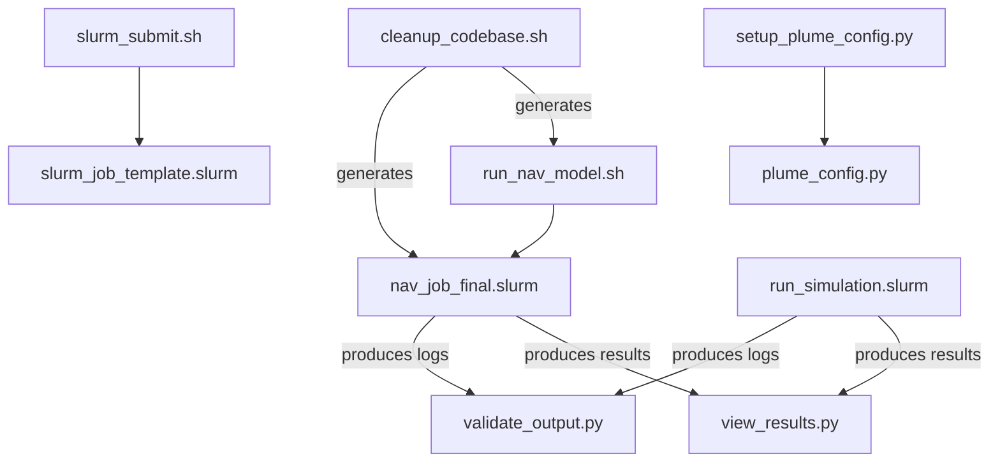

# Root Script Dependency Diagram

This diagram shows how the executable scripts located in the project root depend on each other. Only the files in the root directory are covered here.

```mermaid
graph TD
    cleanup_codebase.sh -->|generates| nav_job_final.slurm
    cleanup_codebase.sh -->|generates| run_nav_model.sh
    run_nav_model.sh --> nav_job_final.slurm
    slurm_submit.sh --> slurm_job_template.slurm
    nav_job_final.slurm -->|produces logs| validate_output.py
    run_simulation.slurm -->|produces logs| validate_output.py
    nav_job_final.slurm -->|produces results| view_results.py
    run_simulation.slurm -->|produces results| view_results.py
    setup_plume_config.py --> plume_config.py
```
