# Root Script Dependency Graph

This diagram lists the discovered dependencies among all scripts located in the repository root. Arrows indicate that a script directly references or calls another script. A dependency on `Code` means the script adds the `Code` directory to the MATLAB path or otherwise directly invokes functions stored there.

View this file on GitHub or another Mermaid-enabled viewer to see the graph.

```mermaid
flowchart TD
    nav_job_paths_fixed_slurm["nav_job_paths_fixed.slurm"] --> Code
    complete_test_slurm["complete_test.slurm"] --> test_both_plumes_complete_m["test_both_plumes_complete.m"]
    complete_test_slurm["complete_test.slurm"] --> generate_clean_configs_m["generate_clean_configs.m"]
    run_simulation_slurm["run_simulation.slurm"] --> Code
    hpc_batch_submit_sh["hpc_batch_submit.sh"] --> nav_job_smoke_slurm["nav_job_smoke.slurm"]
    hpc_batch_submit_sh["hpc_batch_submit.sh"] --> nav_job_crimaldi_slurm["nav_job_crimaldi.slurm"]
    fix_wrapper_section_sh["fix_wrapper_section.sh"] --> setup_smoke_plume_config_sh["setup_smoke_plume_config.sh"]
    fix_wrapper_section_sh["fix_wrapper_section.sh"] --> Code
    test_simple_m["test_simple.m"] --> Code
    fix_matlab_cmd_sh["fix_matlab_cmd.sh"] --> setup_smoke_plume_config_sh["setup_smoke_plume_config.sh"]
    nav_job_smoke_slurm["nav_job_smoke.slurm"] --> Code
    fix_heredoc_sh["fix_heredoc.sh"] --> setup_smoke_plume_config_sh["setup_smoke_plume_config.sh"]
    get_plume_file_m["get_plume_file.m"] --> setup_env_paths_sh["setup_env_paths.sh"]
    run_plume_sim_sh["run_plume_sim.sh"] --> hpc_batch_submit_sh["hpc_batch_submit.sh"]
    run_plume_sim_sh["run_plume_sim.sh"] --> nav_job_smoke_slurm["nav_job_smoke.slurm"]
    run_plume_sim_sh["run_plume_sim.sh"] --> validate_and_submit_plume_sh["validate_and_submit_plume.sh"]
    run_plume_sim_sh["run_plume_sim.sh"] --> hpc_monitor_results_sh["hpc_monitor_results.sh"]
    submit_range_sh["submit_range.sh"] --> Code
    inspect_smoke_hdf5_m["inspect_smoke_hdf5.m"] --> setup_smoke_plume_config_sh["setup_smoke_plume_config.sh"]
    debug_and_fix_sh["debug_and_fix.sh"] --> setup_smoke_plume_config_sh["setup_smoke_plume_config.sh"]
    debug_and_fix_sh["debug_and_fix.sh"] --> create_new_wrapper_sh["create_new_wrapper.sh"]
    setup_smoke_plume_config_sh["setup_smoke_plume_config.sh"] --> Code
    deploy_hpc_tools_sh["deploy_hpc_tools.sh"] --> nav_job_smoke_slurm["nav_job_smoke.slurm"]
    deploy_hpc_tools_sh["deploy_hpc_tools.sh"] --> run_plume_sim_sh["run_plume_sim.sh"]
    deploy_hpc_tools_sh["deploy_hpc_tools.sh"] --> nav_job_crimaldi_slurm["nav_job_crimaldi.slurm"]
    deploy_hpc_tools_sh["deploy_hpc_tools.sh"] --> validate_and_submit_plume_sh["validate_and_submit_plume.sh"]
    deploy_hpc_tools_sh["deploy_hpc_tools.sh"] --> hpc_monitor_results_sh["hpc_monitor_results.sh"]
    deploy_hpc_tools_sh["deploy_hpc_tools.sh"] --> cleanup_results_sh["cleanup_results.sh"]
    deploy_hpc_tools_sh["deploy_hpc_tools.sh"] --> Code
    generated_job_slurm["generated_job.slurm"] --> Code
    diagnose_model_state_m["diagnose_model_state.m"] --> get_plume_file_m["get_plume_file.m"]
    diagnose_model_state_m["diagnose_model_state.m"] --> Code
    run_direct_sh["run_direct.sh"] --> test_simple_m["test_simple.m"]
    run_direct_sh["run_direct.sh"] --> Code
    plot_odor_distance_diagnostic_m["plot_odor_distance_diagnostic.m"] --> test_both_plumes_complete_m["test_both_plumes_complete.m"]
    nav_job_final_slurm["nav_job_final.slurm"] --> Code
    add_startup_confirmation_sh["add_startup_confirmation.sh"] --> setup_smoke_plume_config_sh["setup_smoke_plume_config.sh"]
    test_wrapper_matlab_sh["test_wrapper_matlab.sh"] --> run_test_sh["run_test.sh"]
    simple_fix_sh["simple_fix.sh"] --> setup_smoke_plume_config_sh["setup_smoke_plume_config.sh"]
    create_new_wrapper_sh["create_new_wrapper.sh"] --> setup_smoke_plume_config_sh["setup_smoke_plume_config.sh"]
    nav_job_slurm_sh["nav_job_slurm.sh"] --> nav_job_smoke_slurm["nav_job_smoke.slurm"]
    nav_job_slurm_sh["nav_job_slurm.sh"] --> Code
    add_matlab_logging_sh["add_matlab_logging.sh"] --> setup_smoke_plume_config_sh["setup_smoke_plume_config.sh"]
    add_matlab_logging_sh["add_matlab_logging.sh"] --> Code
    slurm_submit_sh["slurm_submit.sh"] --> slurm_job_template_slurm["slurm_job_template.slurm"]
    unbuffer_output_sh["unbuffer_output.sh"] --> setup_smoke_plume_config_sh["setup_smoke_plume_config.sh"]
    fix_analysis_logic_sh["fix_analysis_logic.sh"] --> setup_smoke_plume_config_sh["setup_smoke_plume_config.sh"]
    run_matlab_safe_sh["run_matlab_safe.sh"] --> Code
    setup_complete_workflow_sh["setup_complete_workflow.sh"] --> quick_validate_sh["quick_validate.sh"]
    setup_complete_workflow_sh["setup_complete_workflow.sh"] --> submit_range_sh["submit_range.sh"]
    setup_complete_workflow_sh["setup_complete_workflow.sh"] --> view_results_py["view_results.py"]
    setup_complete_workflow_sh["setup_complete_workflow.sh"] --> create_results_report_sh["create_results_report.sh"]
    setup_complete_workflow_sh["setup_complete_workflow.sh"] --> validate_and_submit_sh["validate_and_submit.sh"]
    setup_complete_workflow_sh["setup_complete_workflow.sh"] --> setup_validation_workflow_sh["setup_validation_workflow.sh"]
    setup_complete_workflow_sh["setup_complete_workflow.sh"] --> manage_sessions_sh["manage_sessions.sh"]
    setup_complete_workflow_sh["setup_complete_workflow.sh"] --> Code
    run_nav_model_sh["run_nav_model.sh"] --> nav_job_final_slurm["nav_job_final.slurm"]
    nav_job_crimaldi_slurm["nav_job_crimaldi.slurm"] --> Code
    fix_timeout_issue_sh["fix_timeout_issue.sh"] --> setup_smoke_plume_config_sh["setup_smoke_plume_config.sh"]
    fix_timeout_issue_sh["fix_timeout_issue.sh"] --> Code
    setup_hpc_scripts_sh["setup_hpc_scripts.sh"] --> hpc_batch_submit_sh["hpc_batch_submit.sh"]
    setup_hpc_scripts_sh["setup_hpc_scripts.sh"] --> nav_job_smoke_slurm["nav_job_smoke.slurm"]
    setup_hpc_scripts_sh["setup_hpc_scripts.sh"] --> run_plume_sim_sh["run_plume_sim.sh"]
    setup_hpc_scripts_sh["setup_hpc_scripts.sh"] --> setup_smoke_plume_config_sh["setup_smoke_plume_config.sh"]
    setup_hpc_scripts_sh["setup_hpc_scripts.sh"] --> nav_job_crimaldi_slurm["nav_job_crimaldi.slurm"]
    setup_hpc_scripts_sh["setup_hpc_scripts.sh"] --> validate_and_submit_plume_sh["validate_and_submit_plume.sh"]
    setup_hpc_scripts_sh["setup_hpc_scripts.sh"] --> hpc_monitor_results_sh["hpc_monitor_results.sh"]
    fix_quick_mode_sh["fix_quick_mode.sh"] --> setup_smoke_plume_config_sh["setup_smoke_plume_config.sh"]
    setup_env_paths_sh["setup_env_paths.sh"] --> get_plume_file_m["get_plume_file.m"]
    setup_env_paths_sh["setup_env_paths.sh"] --> startup_m["startup.m"]
    setup_env_paths_sh["setup_env_paths.sh"] --> Code
    smoke_simple_slurm["smoke_simple.slurm"] --> Code
    validate_and_submit_sh["validate_and_submit.sh"] --> Code
    cleanup_junk_files_sh["cleanup_junk_files.sh"] --> plot_both_plumes_m["plot_both_plumes.m"]
    cleanup_junk_files_sh["cleanup_junk_files.sh"] --> generate_clean_configs_m["generate_clean_configs.m"]
    cleanup_junk_files_sh["cleanup_junk_files.sh"] --> Code
    fix_wrapper_syntax_sh["fix_wrapper_syntax.sh"] --> setup_smoke_plume_config_sh["setup_smoke_plume_config.sh"]
    validate_and_submit_plume_sh["validate_and_submit_plume.sh"] --> nav_job_smoke_slurm["nav_job_smoke.slurm"]
    validate_and_submit_plume_sh["validate_and_submit_plume.sh"] --> nav_job_crimaldi_slurm["nav_job_crimaldi.slurm"]
    validate_and_submit_plume_sh["validate_and_submit_plume.sh"] --> Code
    startup_m["startup.m"] --> Code
    setup_validation_workflow_sh["setup_validation_workflow.sh"] --> quick_validate_sh["quick_validate.sh"]
    setup_validation_workflow_sh["setup_validation_workflow.sh"] --> submit_range_sh["submit_range.sh"]
    setup_validation_workflow_sh["setup_validation_workflow.sh"] --> validate_and_submit_sh["validate_and_submit.sh"]
    setup_validation_workflow_sh["setup_validation_workflow.sh"] --> manage_sessions_sh["manage_sessions.sh"]
    run_test_sh["run_test.sh"] --> Code
```

