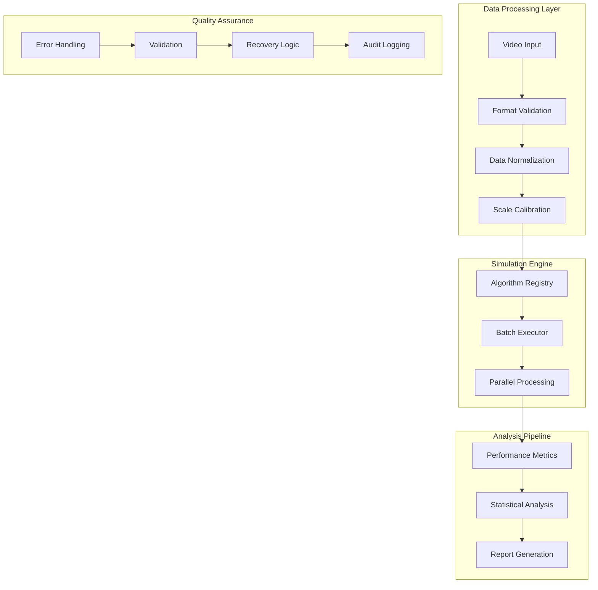

# Plume Navigation Simulation Backend

A robust, enterprise-grade backend system for automated normalization, calibration, and analysis of plume navigation recordings across different physical scales. Designed for scientific research applications with stringent performance, accuracy, and reproducibility requirements.

## Overview

The Plume Navigation Simulation Backend provides a comprehensive computational framework for analyzing olfactory navigation algorithms through standardized simulation workflows. The system addresses critical challenges in comparative algorithm analysis by implementing automated data normalization, batch simulation execution, and statistical validation capabilities.

### System Capabilities

**Core Processing Features:**
- **Automated Normalization Pipeline**: Handles physical scale differences between recordings including arena sizes, pixel resolutions, temporal sampling rates, and intensity units
- **High-Performance Batch Processing**: Executes 4000+ simulations within 8-hour target timeframe with intelligent resource management
- **Cross-Platform Compatibility**: Processes Crimaldi plume data and custom AVI recordings with automated format conversion
- **Real-Time Performance Analysis**: Calculates navigation metrics with statistical validation against reference implementations
- **Parallel Processing Architecture**: Optimizes computational resources through intelligent task distribution and memory management

**Quality Assurance Framework:**
- Fail-fast validation with early error detection
- Graceful degradation with partial batch completion
- Comprehensive error recovery mechanisms
- Checkpoint-based resumption for interrupted operations

### Scientific Computing Standards

**Accuracy Requirements:**
- **Correlation Accuracy**: >95% correlation with reference implementations
- **Reproducibility Coefficient**: >0.99 across different computational environments
- **Cross-Format Processing**: <1% error rate for data format conversion
- **Numerical Precision**: 6 decimal places for performance metrics and scientific calculations

**Performance Targets:**
- **Processing Speed**: <7.2 seconds average per simulation
- **Batch Completion**: 4000+ simulations within 8 hours
- **Memory Usage**: <8GB peak during large-scale processing
- **Resource Efficiency**: Optimal CPU core utilization through parallel processing

**Validation Standards:**
- Statistical validation against known benchmarks
- Cross-platform result consistency verification
- Automated performance regression testing
- Comprehensive audit trails for reproducible research

### Architecture Overview



**Modular Component Design:**
- Independent development and testing of pipeline stages
- Configurable algorithm interfaces for extensibility
- Centralized error handling and recovery systems
- Resource-optimized memory sharing between processing stages

## Quick Start

### Installation

**Using pip (Recommended):**
```bash
pip install plume-navigation-backend
```

**Using conda:**
```bash
conda install -c conda-forge plume-navigation-backend
```

**Development Installation:**
```bash
git clone https://github.com/organization/plume-navigation-backend.git
cd plume-navigation-backend
pip install -e ".[dev]"
```

### Basic Usage

**Single Simulation Execution:**
```bash
# Normalize and execute single simulation
plume-sim run --input data/sample_plume.avi --algorithm random_walk --output results/

# Quick validation of installation
plume-sim validate --check-environment
```

**Batch Processing:**
```bash
# Execute batch simulations with progress tracking
plume-sim batch --config config/batch_config.yaml --simulations 1000 --parallel 8

# Monitor batch progress
plume-sim status --batch-id batch_2024_001
```

### Configuration

**Basic Configuration Setup:**
```bash
# Generate default configuration
plume-sim config init --output config/

# Validate configuration
plume-sim config validate --file config/simulation_config.yaml

# Environment-specific optimization
plume-sim config optimize --hardware auto --output config/optimized.yaml
```

## Installation and Setup

### System Requirements

**Minimum Requirements:**
- **Operating System**: Linux, macOS, Windows 10+
- **Python Version**: Python 3.9+ (3.11+ recommended)
- **Memory**: 8GB RAM minimum, 16GB recommended
- **Storage**: 50GB available disk space for data and results
- **CPU**: Multi-core processor (4+ cores recommended for parallel processing)

**Recommended Computational Environment:**
- **Memory**: 32GB RAM for large-scale batch processing
- **Storage**: SSD storage for optimal I/O performance
- **CPU**: 16+ cores for maximum parallel processing efficiency
- **GPU**: Optional CUDA support for accelerated video processing

### Installation Methods

**Production Installation via pip:**
```bash
# Install stable release
pip install plume-navigation-backend

# Install with optional dependencies
pip install plume-navigation-backend[visualization,parallel,testing]

# Install specific version
pip install plume-navigation-backend==2.1.0
```

**Conda Environment Setup:**
```bash
# Create dedicated environment
conda create -n plume-sim python=3.11
conda activate plume-sim
conda install -c conda-forge plume-navigation-backend

# Install additional scientific packages
conda install numpy=2.1.3 scipy=1.15.3 opencv=4.11.0 pandas=2.2.0
```

**Docker Installation:**
```bash
# Pull pre-built image
docker pull plume-navigation/backend:latest

# Run with volume mounting
docker run -v $(pwd)/data:/app/data -v $(pwd)/results:/app/results \
  plume-navigation/backend:latest plume-sim batch --config /app/data/config.yaml
```

**Development Installation:**
```bash
# Clone repository
git clone https://github.com/organization/plume-navigation-backend.git
cd plume-navigation-backend

# Install in development mode
pip install -e ".[dev,test,docs]"

# Install pre-commit hooks
pre-commit install

# Run development validation
python -m pytest tests/ --cov=src/
```

### Environment Validation

**Automated Environment Check:**
```bash
# Comprehensive environment validation
plume-sim doctor --verbose

# Check specific components
plume-sim doctor --check-dependencies --check-hardware --check-test-data

# Generate environment report
plume-sim doctor --report --output environment_report.json
```

**Manual Validation Steps:**
```python
# Verify core functionality
import plume_navigation_backend as pnb

# Test data processing pipeline
pipeline = pnb.DataNormalizationPipeline()
result = pipeline.validate_environment()
print(f"Environment Status: {result.status}")

# Test parallel processing capability
executor = pnb.BatchSimulationExecutor(parallel_workers=4)
performance = executor.benchmark_performance()
print(f"Processing Capability: {performance.simulations_per_hour} sim/hour")
```

### Dependency Management

**Core Dependencies (automatically installed):**
```yaml
# Core Scientific Computing
numpy: ">=2.1.3"          # Numerical computation foundation
scipy: ">=1.15.3"          # Statistical analysis and optimization
pandas: ">=2.2.0"          # Data manipulation and analysis

# Video Processing
opencv-python: ">=4.11.0"  # Video file processing and computer vision

# Parallel Processing
joblib: ">=1.6.0"          # Parallel execution and caching

# Visualization
matplotlib: ">=3.9.0"      # Scientific plotting and visualization
seaborn: ">=0.13.2"        # Statistical visualization enhancement
```

**Optional Dependencies:**
```yaml
# Testing Framework
pytest: ">=8.3.5"          # Unit and integration testing
pytest-cov: ">=5.0.0"      # Coverage reporting
pytest-benchmark: ">=4.0.0" # Performance benchmarking

# Documentation
sphinx: ">=7.1.0"          # Documentation generation
sphinx-rtd-theme: ">=2.0.0" # Documentation theme

# Development Tools
black: ">=24.0.0"          # Code formatting
flake8: ">=7.0.0"          # Code linting
mypy: ">=1.8.0"            # Type checking
```

**Compatibility Matrix:**
| Python Version | NumPy | SciPy | OpenCV | Status |
|----------------|-------|-------|--------|--------|
| 3.9.x | 2.1.3+ | 1.15.3+ | 4.11.0+ | Supported |
| 3.10.x | 2.1.3+ | 1.15.3+ | 4.11.0+ | Supported |
| 3.11.x | 2.1.3+ | 1.15.3+ | 4.11.0+ | Recommended |
| 3.12.x | 2.1.3+ | 1.15.3+ | 4.11.0+ | Supported |

## Core Components

### Data Normalization Pipeline

The data normalization pipeline provides automated handling of physical differences between plume recordings, ensuring consistent and comparable simulation inputs across different experimental conditions.

**Scale Calibration System:**
```python
from plume_navigation_backend.core import DataNormalizationPipeline

# Initialize normalization pipeline
normalizer = DataNormalizationPipeline(
    target_resolution=(640, 480),
    temporal_sampling_rate=30.0,
    intensity_range=(0.0, 1.0),
    calibration_method='arena_detection'
)

# Process Crimaldi dataset
crimaldi_data = normalizer.normalize_crimaldi_format(
    input_path="data/crimaldi_plume.avi",
    arena_size_meters=1.0,
    pixel_scale_factor=0.001
)

# Process custom AVI recording
custom_data = normalizer.normalize_custom_format(
    input_path="data/custom_recording.avi",
    metadata_file="data/recording_metadata.json",
    auto_calibrate=True
)
```

**Normalization Features:**
- **Spatial Resolution**: Automated pixel-to-physical unit conversion with arena detection
- **Temporal Sampling**: Consistent frame rate normalization across different recording speeds
- **Intensity Calibration**: Standardized concentration unit conversion with dynamic range optimization
- **Format Conversion**: Seamless handling of different video formats and metadata structures

**Quality Validation:**
- Pre-processing integrity checks for corrupted or incomplete video files
- Calibration parameter validation with statistical outlier detection
- Cross-format consistency verification with correlation analysis
- Automated generation of normalization quality reports

### Simulation Engine

The simulation engine provides high-performance execution of navigation algorithms with intelligent resource management and comprehensive progress monitoring.

**Algorithm Registry System:**
```python
from plume_navigation_backend.simulation import SimulationEngine, AlgorithmRegistry

# Initialize simulation engine
engine = SimulationEngine(
    parallel_workers=8,
    memory_limit_gb=16,
    checkpoint_interval=100,
    progress_reporting=True
)

# Register navigation algorithms
registry = AlgorithmRegistry()
registry.register_algorithm('random_walk', RandomWalkAlgorithm)
registry.register_algorithm('gradient_following', GradientFollowingAlgorithm)
registry.register_algorithm('particle_filter', ParticleFilterAlgorithm)

# Execute single simulation
result = engine.execute_simulation(
    algorithm_name='gradient_following',
    plume_data=normalized_data,
    parameters={'step_size': 0.1, 'sensing_radius': 0.05},
    simulation_id='sim_001'
)
```

**Batch Processing Capabilities:**
```python
# Configure batch execution
batch_config = {
    'algorithms': ['random_walk', 'gradient_following', 'particle_filter'],
    'parameter_grid': {
        'step_size': [0.05, 0.1, 0.15],
        'sensing_radius': [0.03, 0.05, 0.07]
    },
    'replication_count': 10,
    'parallel_execution': True
}

# Execute batch simulations
batch_results = engine.execute_batch(
    plume_datasets=['dataset_001', 'dataset_002', 'dataset_003'],
    configuration=batch_config,
    target_completion_time_hours=8
)
```

**Performance Optimization:**
- Intelligent task scheduling with load balancing
- Memory-mapped data access for large video files
- Checkpointing system for long-running batch operations
- Resource utilization monitoring with automatic scaling

### Analysis Pipeline

The analysis pipeline provides comprehensive performance evaluation and statistical comparison capabilities for navigation algorithm validation.

**Performance Metrics Calculation:**
```python
from plume_navigation_backend.analysis import PerformanceMetricsCalculator

# Initialize metrics calculator
calculator = PerformanceMetricsCalculator(
    metrics=['success_rate', 'path_efficiency', 'localization_time'],
    statistical_validation=True,
    reference_benchmarks='crimaldi_reference'
)

# Calculate algorithm performance
performance_results = calculator.analyze_simulation_results(
    simulation_data=batch_results,
    group_by=['algorithm', 'plume_dataset'],
    statistical_tests=['t_test', 'mann_whitney', 'anova']
)

# Generate comparative analysis
comparison = calculator.compare_algorithms(
    baseline_algorithm='random_walk',
    test_algorithms=['gradient_following', 'particle_filter'],
    significance_level=0.05
)
```

**Statistical Analysis Framework:**
- Navigation success rate analysis with confidence intervals
- Path efficiency metrics including total distance and search pattern analysis
- Temporal performance evaluation with localization time distribution
- Robustness assessment across different environmental conditions
- Cross-format validation with correlation analysis

**Report Generation:**
```python
from plume_navigation_backend.analysis import ReportGenerator

# Generate comprehensive analysis report
report = ReportGenerator(
    template='scientific_publication',
    include_visualizations=True,
    statistical_detail_level='comprehensive'
)

# Create publication-ready report
output = report.generate_report(
    performance_data=performance_results,
    comparison_data=comparison,
    output_format='pdf',
    output_path='reports/algorithm_comparison_2024.pdf'
)
```

### Error Handling System

Comprehensive error handling framework ensuring robust operation across the entire processing pipeline with intelligent recovery mechanisms.

**Error Detection and Classification:**
```python
from plume_navigation_backend.error import ErrorHandler, ErrorRecovery

# Initialize error handling system
error_handler = ErrorHandler(
    fail_fast_validation=True,
    graceful_degradation=True,
    automatic_recovery=True,
    comprehensive_logging=True
)

# Register error recovery strategies
recovery = ErrorRecovery()
recovery.register_strategy('data_validation_error', 'skip_and_log')
recovery.register_strategy('memory_exhaustion', 'reduce_parallel_workers')
recovery.register_strategy('algorithm_failure', 'retry_with_fallback')
```

**Error Recovery Mechanisms:**
- **Transient Error Handling**: Exponential backoff retry logic for temporary failures
- **Resource Management**: Automatic resource optimization when limits are exceeded
- **Checkpoint Recovery**: Resumption from last successful state for interrupted operations
- **Graceful Degradation**: Partial completion with detailed failure reporting

**Quality Assurance Integration:**
- Pre-processing validation with format compatibility verification
- Real-time monitoring of processing pipeline health
- Automatic detection of corrupted data or invalid parameters
- Comprehensive audit trails for debugging and compliance

### Utilities and Infrastructure

Supporting infrastructure providing logging, memory management, parallel processing coordination, and configuration management capabilities.

**Logging and Monitoring:**
```python
from plume_navigation_backend.utils import Logger, PerformanceMonitor

# Configure structured logging
logger = Logger(
    level='INFO',
    format='scientific_detailed',
    output_destinations=['console', 'file', 'structured_json'],
    audit_trail=True
)

# Initialize performance monitoring
monitor = PerformanceMonitor(
    metrics=['cpu_usage', 'memory_consumption', 'disk_io', 'processing_rate'],
    sampling_interval=30,
    alert_thresholds={'memory_usage': 0.9, 'processing_rate': 0.5}
)
```

**Memory Management:**
```python
from plume_navigation_backend.utils import MemoryManager

# Configure memory optimization
memory_manager = MemoryManager(
    caching_strategy='multi_level',
    memory_limit_gb=16,
    cache_cleanup_threshold=0.85,
    data_compression=True
)

# Memory-efficient data processing
with memory_manager.managed_context():
    large_dataset = memory_manager.load_optimized(
        data_path="large_plume_dataset.avi",
        chunk_size_mb=512
    )
```

## Command-Line Interface

Comprehensive CLI providing intuitive access to all system capabilities with progress visualization, error handling, and configuration management.

### CLI Commands

**Data Processing Commands:**
```bash
# Normalize single plume recording
plume-sim normalize \
  --input data/plume_recording.avi \
  --output data/normalized/ \
  --format crimaldi \
  --arena-size 1.0 \
  --target-resolution 640x480

# Batch normalization with progress tracking
plume-sim normalize-batch \
  --input-dir data/raw_recordings/ \
  --output-dir data/normalized_batch/ \
  --config config/normalization.yaml \
  --parallel 4 \
  --progress-bar
```

**Simulation Execution Commands:**
```bash
# Execute single simulation
plume-sim run \
  --algorithm gradient_following \
  --plume-data data/normalized/plume_001.npz \
  --parameters config/algorithm_params.json \
  --output results/sim_001/ \
  --verbose

# Batch simulation execution
plume-sim batch \
  --config config/batch_config.yaml \
  --simulations 4000 \
  --parallel 16 \
  --checkpoint-interval 100 \
  --max-time 8h \
  --resume-from-checkpoint

# Parameter sweep execution
plume-sim sweep \
  --algorithm particle_filter \
  --parameter-grid config/param_grid.yaml \
  --datasets data/normalized/*.npz \
  --replications 10 \
  --output results/parameter_sweep/
```

**Analysis and Reporting Commands:**
```bash
# Generate performance analysis
plume-sim analyze \
  --results-dir results/batch_001/ \
  --metrics success_rate,path_efficiency,localization_time \
  --statistical-tests t_test,mann_whitney \
  --output reports/analysis_001.json

# Compare algorithm performance
plume-sim compare \
  --baseline results/random_walk/ \
  --algorithms results/gradient_following/,results/particle_filter/ \
  --significance-level 0.05 \
  --output reports/algorithm_comparison.pdf

# Generate comprehensive report
plume-sim report \
  --template scientific_publication \
  --data reports/analysis_001.json \
  --visualizations \
  --output reports/final_report.pdf
```

**System Management Commands:**
```bash
# System status and health check
plume-sim status --detailed --health-check

# Environment validation
plume-sim doctor \
  --check-dependencies \
  --check-hardware \
  --check-test-data \
  --output environment_report.json

# Performance benchmarking
plume-sim benchmark \
  --dataset data/test_dataset.npz \
  --algorithms all \
  --iterations 100 \
  --output benchmark_results.json
```

### Configuration Options

**Global Configuration Flags:**
```bash
# Logging and output control
--verbose, -v          # Detailed output with debug information
--quiet, -q           # Minimal output, errors only
--log-file FILE       # Redirect logs to specified file
--log-level LEVEL     # Set logging level (DEBUG, INFO, WARNING, ERROR)

# Performance and resource control
--parallel N          # Number of parallel workers
--memory-limit GB     # Maximum memory usage
--cpu-limit PERCENT   # CPU usage limitation
--priority LEVEL      # Process priority (low, normal, high)

# Output and formatting options
--output-format FORMAT # Output format (json, yaml, csv, text)
--no-color            # Disable color output
--progress-bar        # Enable ASCII progress bars
--timestamp           # Include timestamps in output
```

**Configuration File Integration:**
```bash
# Use configuration file
plume-sim run --config config/production.yaml

# Override specific parameters
plume-sim run --config config/base.yaml --override algorithm=particle_filter

# Validate configuration
plume-sim config validate --file config/production.yaml --strict

# Generate configuration template
plume-sim config template --output config/template.yaml --include-examples
```

### Progress Visualization

**ASCII Progress Bars with Scientific Metrics:**
```
Batch Simulation Progress:
[████████████████████████████████████████] 100% | 4000/4000 simulations
├─ Random Walk:        [████████████████████] 100% | 1334/1334 | Avg: 6.8s
├─ Gradient Following: [██████████████████  ] 90%  | 1200/1334 | Avg: 7.1s
└─ Particle Filter:    [████████████        ] 67%  | 894/1334  | Avg: 7.5s

Performance Metrics:
• Success Rate:     87.3% ± 2.1%
• Avg Path Length: 12.4m ± 1.8m
• Localization Time: 45.2s ± 8.3s
• Memory Usage:     12.3GB / 16.0GB
• Estimated Completion: 2h 15m remaining
```

**Color-Coded Status Display:**
```
System Status Overview:
✓ Data Normalization Pipeline:  HEALTHY
✓ Simulation Engine:           HEALTHY  
⚠ Memory Usage:                HIGH (89%)
✓ Parallel Processing:         OPTIMAL (16/16 cores)
✗ Algorithm: gradient_following ERROR (3 failures)

Recent Activity:
[2024-12-02 14:30:15] INFO  Completed simulation batch_001 (1000 simulations)
[2024-12-02 14:28:43] WARN  Memory usage approaching limit (85%)
[2024-12-02 14:25:12] ERROR Algorithm failure: gradient_following (retrying)
```

### Error Handling

**Error Code Reference:**
```bash
# Exit codes and their meanings
0   # Success
1   # General error
2   # Configuration error
3   # Data validation error
4   # Algorithm execution error
5   # Resource limitation error
10  # System environment error
11  # Dependency missing error
20  # User interruption (Ctrl+C)
```

**Error Recovery and Troubleshooting:**
```bash
# Automatic error recovery
plume-sim run --auto-retry --max-retries 3 --retry-delay 30

# Error diagnosis
plume-sim diagnose --error-log logs/error.log --suggest-fixes

# System repair utilities
plume-sim repair --fix-permissions --validate-data --rebuild-cache
```

## Configuration Management

Comprehensive configuration system supporting hierarchical parameter management, environment-specific optimization, and scientific reproducibility requirements.

### Configuration Files

**Normalization Configuration (`config/normalization.yaml`):**
```yaml
# Data Normalization Configuration
normalization:
  spatial:
    target_resolution: [640, 480]        # Target pixel resolution
    interpolation_method: 'bilinear'     # Interpolation algorithm
    preserve_aspect_ratio: true         # Maintain original aspect ratio
    
  temporal:
    target_framerate: 30.0              # Target frames per second
    interpolation_method: 'linear'      # Temporal interpolation
    synchronization: 'arena_detection'  # Temporal alignment method
    
  intensity:
    target_range: [0.0, 1.0]            # Normalized intensity range
    calibration_method: 'histogram_equalization'
    background_subtraction: true        # Remove background noise
    
  validation:
    min_correlation: 0.95               # Minimum correlation with reference
    max_error_rate: 0.01                # Maximum acceptable error rate
    statistical_tests: ['ks_test', 'chi_square']
```

**Simulation Configuration (`config/simulation.yaml`):**
```yaml
# Simulation Engine Configuration
simulation:
  execution:
    parallel_workers: 16                # Number of parallel processes
    memory_limit_gb: 32                 # Maximum memory usage
    checkpoint_interval: 100            # Checkpoint frequency
    timeout_seconds: 300                # Per-simulation timeout
    
  algorithms:
    random_walk:
      step_size: 0.1                    # Movement step size (meters)
      sensing_radius: 0.05              # Chemical sensing radius
      bias_strength: 0.0                # Directional bias (0=none, 1=strong)
      
    gradient_following:
      step_size: 0.08                   # Movement step size
      sensing_radius: 0.04              # Chemical sensing radius
      gradient_threshold: 0.001         # Minimum gradient for movement
      adaptation_rate: 0.1              # Learning rate for adaptation
      
    particle_filter:
      particle_count: 1000              # Number of particles
      measurement_noise: 0.05           # Sensor noise standard deviation
      process_noise: 0.02               # Movement noise standard deviation
      resampling_threshold: 0.5         # Effective sample size threshold
      
  performance:
    target_simulation_time: 7.2         # Target seconds per simulation
    batch_completion_hours: 8           # Maximum batch completion time
    resource_optimization: true        # Enable automatic resource tuning
```

**Analysis Configuration (`config/analysis.yaml`):**
```yaml
# Analysis Pipeline Configuration
analysis:
  metrics:
    navigation:
      - success_rate                    # Source localization success
      - path_efficiency                 # Ratio optimal/actual path length
      - localization_time              # Time to successful localization
      - search_coverage               # Percentage of arena explored
      
    statistical:
      confidence_level: 0.95           # Statistical confidence level
      significance_threshold: 0.05     # P-value threshold
      effect_size_minimum: 0.2         # Minimum meaningful effect size
      
  comparison:
    baseline_algorithm: 'random_walk'   # Reference algorithm for comparison
    statistical_tests:
      - 't_test'                       # Parametric comparison
      - 'mann_whitney'                 # Non-parametric comparison
      - 'anova'                        # Multi-group comparison
      - 'kruskal_wallis'               # Non-parametric multi-group
      
  visualization:
    trajectory_plots: true             # Generate trajectory visualizations
    performance_distributions: true    # Show metric distributions
    correlation_matrices: true         # Algorithm correlation analysis
    publication_quality: true          # High-resolution, publication-ready plots
```

### Parameter Reference

**Core Processing Parameters:**

| Parameter | Type | Range | Default | Description |
|-----------|------|-------|---------|-------------|
| `target_resolution` | tuple | (320,240)-(1920,1080) | (640,480) | Output video resolution in pixels |
| `target_framerate` | float | 10.0-120.0 | 30.0 | Normalized frames per second |
| `parallel_workers` | int | 1-64 | CPU count | Number of parallel simulation workers |
| `memory_limit_gb` | int | 4-128 | 16 | Maximum memory usage in gigabytes |
| `checkpoint_interval` | int | 10-1000 | 100 | Simulations between checkpoints |

**Algorithm-Specific Parameters:**

| Algorithm | Parameter | Type | Range | Default | Scientific Context |
|-----------|-----------|------|-------|---------|-------------------|
| Random Walk | `step_size` | float | 0.01-0.5 | 0.1 | Movement distance per time step (meters) |
| Random Walk | `sensing_radius` | float | 0.01-0.2 | 0.05 | Chemical detection radius (meters) |
| Gradient Following | `gradient_threshold` | float | 1e-6-1e-2 | 1e-3 | Minimum gradient for directional movement |
| Particle Filter | `particle_count` | int | 100-10000 | 1000 | Number of particles for state estimation |
| Particle Filter | `measurement_noise` | float | 0.001-0.2 | 0.05 | Sensor measurement uncertainty |

**Performance Optimization Parameters:**

| Parameter | Impact | Tuning Guidelines | Scientific Implications |
|-----------|--------|-------------------|------------------------|
| `parallel_workers` | Processing speed | Match CPU core count | Affects reproducibility of random processes |
| `memory_limit_gb` | Cache efficiency | 2x peak dataset size | Impacts large-scale batch processing |
| `checkpoint_interval` | Recovery time | Balance disk I/O vs memory | Determines granularity of resumable operations |

### Environment Variables

**Runtime Configuration:**
```bash
# Core system configuration
export PLUME_SIM_HOME="/opt/plume-simulation"          # Installation directory
export PLUME_SIM_DATA="/data/plume-datasets"           # Default data directory
export PLUME_SIM_RESULTS="/results/simulations"        # Default results directory
export PLUME_SIM_CONFIG="/etc/plume-sim/config.yaml"   # System configuration file

# Performance tuning
export PLUME_SIM_PARALLEL_WORKERS="16"                 # Override parallel workers
export PLUME_SIM_MEMORY_LIMIT="32"                     # Memory limit in GB
export PLUME_SIM_CPU_AFFINITY="0-15"                   # CPU core assignment
export PLUME_SIM_PRIORITY="high"                       # Process priority

# Scientific computing
export PLUME_SIM_PRECISION="double"                    # Numerical precision
export PLUME_SIM_RANDOM_SEED="42"                      # Reproducibility seed
export PLUME_SIM_VALIDATION_STRICT="true"              # Strict validation mode
export PLUME_SIM_CORRELATION_THRESHOLD="0.95"          # Minimum correlation requirement

# Logging and debugging
export PLUME_SIM_LOG_LEVEL="INFO"                      # Logging verbosity
export PLUME_SIM_LOG_FILE="/var/log/plume-sim.log"     # Log file location
export PLUME_SIM_DEBUG_MODE="false"                    # Enable debug features
export PLUME_SIM_PROFILE_PERFORMANCE="false"           # Performance profiling
```

**Development Environment:**
```bash
# Development-specific settings
export PLUME_SIM_DEV_MODE="true"                       # Enable development features
export PLUME_SIM_TEST_DATA="/dev/test-datasets"        # Test data location
export PLUME_SIM_COVERAGE_REPORT="true"                # Generate coverage reports
export PLUME_SIM_BENCHMARK_MODE="false"                # Performance benchmarking
```

### Advanced Configuration

**Scientific Reproducibility Configuration:**
```yaml
# Reproducibility and validation settings
reproducibility:
  random_seed: 42                      # Global random seed for reproducibility
  numerical_precision: 'double'       # Floating-point precision (single/double)
  correlation_validation:
    enabled: true                      # Validate against reference implementations
    threshold: 0.95                    # Minimum correlation coefficient
    reference_dataset: 'crimaldi_benchmark'
    
  cross_platform_validation:
    enabled: true                      # Test across different platforms
    platforms: ['linux', 'macos', 'windows']
    tolerance: 1e-6                    # Numerical tolerance for differences
```

**Resource Optimization Configuration:**
```yaml
# Advanced performance tuning
performance:
  memory_management:
    caching_strategy: 'multi_level'    # Cache optimization strategy
    cache_size_gb: 8                   # Cache size limit
    memory_mapping: true               # Use memory-mapped files
    garbage_collection: 'optimized'    # GC optimization mode
    
  parallel_processing:
    algorithm: 'work_stealing'         # Load balancing algorithm
    affinity_policy: 'spread'          # CPU affinity distribution
    numa_awareness: true               # NUMA-aware scheduling
    
  io_optimization:
    buffer_size_mb: 64                 # I/O buffer size
    async_io: true                     # Asynchronous I/O operations
    compression: 'lz4'                 # Data compression algorithm
```

## API Documentation

Comprehensive programming interface for integration with research workflows, custom algorithm development, and automated pipeline orchestration.

### Core API

**PlumeSimulationSystem - Main System Interface:**
```python
from plume_navigation_backend import PlumeSimulationSystem

class PlumeSimulationSystem:
    """
    Main interface for plume navigation simulation system.
    
    Provides unified access to data normalization, simulation execution,
    and analysis capabilities with scientific computing standards.
    """
    
    def __init__(self, 
                 config_path: str = None,
                 parallel_workers: int = None,
                 memory_limit_gb: int = None,
                 random_seed: int = 42):
        """
        Initialize simulation system with configuration.
        
        Args:
            config_path: Path to YAML configuration file
            parallel_workers: Number of parallel processing workers
            memory_limit_gb: Maximum memory usage in gigabytes
            random_seed: Random seed for reproducible results
        """
        
    def normalize_data(self, 
                      input_path: str,
                      output_path: str,
                      format_type: str = 'auto',
                      validation: bool = True) -> NormalizationResult:
        """
        Normalize plume recording data for simulation.
        
        Args:
            input_path: Path to input video file
            output_path: Path for normalized output
            format_type: Data format ('crimaldi', 'custom', 'auto')
            validation: Enable statistical validation
            
        Returns:
            NormalizationResult with processing metadata and quality metrics
        """
        
    def execute_simulation(self,
                          algorithm_name: str,
                          plume_data_path: str,
                          parameters: Dict[str, Any],
                          output_path: str = None) -> SimulationResult:
        """
        Execute single navigation algorithm simulation.
        
        Args:
            algorithm_name: Registered algorithm identifier
            plume_data_path: Path to normalized plume data
            parameters: Algorithm-specific parameters
            output_path: Path for simulation results
            
        Returns:
            SimulationResult with trajectory data and performance metrics
        """
        
    def execute_batch(self,
                     batch_config: BatchConfiguration,
                     progress_callback: Callable = None) -> BatchResult:
        """
        Execute batch simulations with parallel processing.
        
        Args:
            batch_config: Batch execution configuration
            progress_callback: Optional progress reporting function
            
        Returns:
            BatchResult with aggregated simulation results
        """
        
    def analyze_results(self,
                       results_path: str,
                       analysis_config: AnalysisConfiguration) -> AnalysisResult:
        """
        Analyze simulation results with statistical validation.
        
        Args:
            results_path: Path to simulation results
            analysis_config: Analysis configuration parameters
            
        Returns:
            AnalysisResult with performance metrics and statistical tests
        """
```

**IntegratedPipeline - Workflow Orchestration:**
```python
from plume_navigation_backend.core import IntegratedPipeline

class IntegratedPipeline:
    """
    End-to-end pipeline for automated simulation workflows.
    
    Orchestrates data normalization, simulation execution, and analysis
    with comprehensive error handling and progress monitoring.
    """
    
    def execute_complete_workflow(self,
                                 data_sources: List[str],
                                 algorithms: List[str],
                                 parameter_grids: Dict[str, List],
                                 analysis_metrics: List[str],
                                 output_directory: str) -> WorkflowResult:
        """
        Execute complete simulation workflow from raw data to analysis.
        
        Args:
            data_sources: List of input video file paths
            algorithms: Navigation algorithms to test
            parameter_grids: Parameter combinations for each algorithm
            analysis_metrics: Performance metrics to calculate
            output_directory: Base directory for all outputs
            
        Returns:
            WorkflowResult with comprehensive pipeline results
        """
        
    def resume_workflow(self,
                       checkpoint_path: str,
                       modified_config: Dict = None) -> WorkflowResult:
        """
        Resume interrupted workflow from checkpoint.
        
        Args:
            checkpoint_path: Path to workflow checkpoint file
            modified_config: Optional configuration modifications
            
        Returns:
            WorkflowResult continuing from checkpoint state
        """
```

### Data Normalization API

**DataNormalizationPipeline - Core Normalization Interface:**
```python
from plume_navigation_backend.normalization import DataNormalizationPipeline

class DataNormalizationPipeline:
    """
    Automated normalization pipeline for plume recording data.
    
    Handles spatial scaling, temporal alignment, and intensity calibration
    with validation against scientific accuracy requirements.
    """
    
    def normalize_crimaldi_format(self,
                                 input_path: str,
                                 arena_diameter_meters: float,
                                 metadata: CrimaldiMetadata = None) -> NormalizedData:
        """
        Normalize Crimaldi dataset format with automated calibration.
        
        Args:
            input_path: Path to Crimaldi format video file
            arena_diameter_meters: Physical arena diameter
            metadata: Optional metadata override
            
        Returns:
            NormalizedData with standardized spatial and temporal scaling
        """
        
    def normalize_custom_format(self,
                               input_path: str,
                               calibration_file: str,
                               validation_strict: bool = True) -> NormalizedData:
        """
        Normalize custom video format with external calibration.
        
        Args:
            input_path: Path to custom format video file
            calibration_file: Path to calibration parameters
            validation_strict: Enable strict validation requirements
            
        Returns:
            NormalizedData with verified normalization quality
        """
        
    def validate_normalization(self,
                              normalized_data: NormalizedData,
                              reference_data: NormalizedData = None) -> ValidationResult:
        """
        Validate normalization quality against reference standards.
        
        Args:
            normalized_data: Normalized dataset to validate
            reference_data: Optional reference for comparison
            
        Returns:
            ValidationResult with correlation and quality metrics
        """
```

**Format-Specific Handlers:**
```python
from plume_navigation_backend.normalization.formats import CrimaldiHandler, AVIHandler

class CrimaldiHandler:
    """Specialized handler for Crimaldi plume dataset format."""
    
    def extract_metadata(self, file_path: str) -> CrimaldiMetadata:
        """Extract embedded metadata from Crimaldi format files."""
        
    def calibrate_spatial_scale(self, video_data: np.ndarray, 
                               arena_size: float) -> SpatialCalibration:
        """Calibrate pixel-to-meter conversion using arena detection."""
        
    def normalize_temporal_sampling(self, video_data: np.ndarray,
                                   target_fps: float) -> np.ndarray:
        """Normalize frame rate with temporal interpolation."""

class AVIHandler:
    """Generic AVI format handler with flexible calibration."""
    
    def load_with_metadata(self, file_path: str, 
                          metadata_file: str) -> Tuple[np.ndarray, Metadata]:
        """Load AVI file with external metadata."""
        
    def auto_calibrate(self, video_data: np.ndarray) -> AutoCalibrationResult:
        """Attempt automatic calibration using image analysis."""
```

### Simulation API

**SimulationEngine - Core Execution Interface:**
```python
from plume_navigation_backend.simulation import SimulationEngine

class SimulationEngine:
    """
    High-performance simulation engine with parallel processing.
    
    Manages algorithm execution, resource allocation, and result collection
    with emphasis on scientific reproducibility and performance optimization.
    """
    
    def register_algorithm(self,
                          name: str,
                          algorithm_class: Type[NavigationAlgorithm],
                          default_parameters: Dict[str, Any] = None):
        """
        Register navigation algorithm for batch execution.
        
        Args:
            name: Unique algorithm identifier
            algorithm_class: Algorithm implementation class
            default_parameters: Default parameter values
        """
        
    def execute_parallel_batch(self,
                              algorithm_configs: List[AlgorithmConfig],
                              plume_datasets: List[str],
                              resource_limits: ResourceConfig) -> BatchExecutionResult:
        """
        Execute batch simulations with optimized parallel processing.
        
        Args:
            algorithm_configs: Algorithm configurations for execution
            plume_datasets: Normalized plume data files
            resource_limits: Resource allocation constraints
            
        Returns:
            BatchExecutionResult with performance metrics and timing data
        """
        
    def monitor_execution(self,
                         batch_id: str) -> ExecutionStatus:
        """
        Monitor progress of running batch execution.
        
        Args:
            batch_id: Unique batch execution identifier
            
        Returns:
            ExecutionStatus with current progress and performance metrics
        """
```

**Algorithm Interface Definition:**
```python
from plume_navigation_backend.simulation.interfaces import NavigationAlgorithm

class NavigationAlgorithm(ABC):
    """
    Abstract base class for navigation algorithm implementations.
    
    Defines standard interface for algorithm integration with simulation
    engine and ensures consistent parameter handling and result format.
    """
    
    @abstractmethod
    def initialize(self, 
                  plume_data: np.ndarray,
                  parameters: Dict[str, Any],
                  random_seed: int = None) -> None:
        """
        Initialize algorithm with plume data and parameters.
        
        Args:
            plume_data: Normalized plume concentration field
            parameters: Algorithm-specific parameters
            random_seed: Random seed for reproducible results
        """
        
    @abstractmethod
    def execute_simulation(self,
                          max_steps: int = 10000,
                          success_criteria: SuccessCriteria = None) -> SimulationResult:
        """
        Execute navigation simulation until success or timeout.
        
        Args:
            max_steps: Maximum simulation steps before timeout
            success_criteria: Criteria for successful source localization
            
        Returns:
            SimulationResult with trajectory and performance data
        """
        
    @abstractmethod
    def get_parameter_schema(self) -> ParameterSchema:
        """
        Get parameter schema for validation and documentation.
        
        Returns:
            ParameterSchema defining valid parameters and ranges
        """
```

### Analysis API

**PerformanceMetricsCalculator - Metrics Analysis Interface:**
```python
from plume_navigation_backend.analysis import PerformanceMetricsCalculator

class PerformanceMetricsCalculator:
    """
    Comprehensive performance analysis for navigation algorithms.
    
    Calculates standardized metrics with statistical validation and
    cross-algorithm comparison capabilities.
    """
    
    def calculate_navigation_metrics(self,
                                   simulation_results: List[SimulationResult],
                                   group_by: List[str] = None) -> MetricsResult:
        """
        Calculate comprehensive navigation performance metrics.
        
        Args:
            simulation_results: List of completed simulation results
            group_by: Grouping criteria for aggregated analysis
            
        Returns:
            MetricsResult with calculated performance metrics
        """
        
    def statistical_comparison(self,
                              baseline_results: List[SimulationResult],
                              test_results: List[SimulationResult],
                              statistical_tests: List[str] = None) -> ComparisonResult:
        """
        Perform statistical comparison between algorithm results.
        
        Args:
            baseline_results: Baseline algorithm results
            test_results: Test algorithm results for comparison
            statistical_tests: Statistical tests to perform
            
        Returns:
            ComparisonResult with statistical test results and effect sizes
        """
        
    def generate_correlation_analysis(self,
                                     results_matrix: np.ndarray,
                                     algorithm_names: List[str]) -> CorrelationAnalysis:
        """
        Generate correlation analysis between algorithm performances.
        
        Args:
            results_matrix: Matrix of algorithm performance results
            algorithm_names: Names of algorithms for labeling
            
        Returns:
            CorrelationAnalysis with correlation coefficients and significance
        """
```

**ReportGenerator - Publication-Quality Reporting:**
```python
from plume_navigation_backend.analysis import ReportGenerator

class ReportGenerator:
    """
    Publication-quality report generation for scientific analysis.
    
    Creates comprehensive reports with visualizations, statistical analysis,
    and formatted output suitable for scientific publication.
    """
    
    def generate_comprehensive_report(self,
                                    analysis_results: AnalysisResult,
                                    template: str = 'scientific_publication',
                                    include_visualizations: bool = True) -> Report:
        """
        Generate comprehensive analysis report.
        
        Args:
            analysis_results: Complete analysis results
            template: Report template ('scientific_publication', 'technical', 'summary')
            include_visualizations: Include trajectory and performance plots
            
        Returns:
            Report object with formatted content and visualizations
        """
        
    def export_publication_figures(self,
                                  analysis_results: AnalysisResult,
                                  output_directory: str,
                                  format: str = 'png',
                                  dpi: int = 300) -> List[str]:
        """
        Export publication-quality figures for external use.
        
        Args:
            analysis_results: Analysis results for visualization
            output_directory: Directory for exported figures
            format: Output format ('png', 'pdf', 'svg', 'eps')
            dpi: Resolution for raster formats
            
        Returns:
            List of exported figure file paths
        """
```

### Utilities API

**Logging and Monitoring Utilities:**
```python
from plume_navigation_backend.utils import Logger, PerformanceProfiler

class Logger:
    """
    Scientific computing focused logging with audit trails.
    
    Provides structured logging with scientific computing context,
    performance metrics, and comprehensive audit trail capabilities.
    """
    
    def log_simulation_start(self,
                           algorithm_name: str,
                           parameters: Dict[str, Any],
                           plume_data_info: Dict[str, Any]) -> str:
        """Log simulation initialization with full context."""
        
    def log_performance_metrics(self,
                              simulation_id: str,
                              metrics: Dict[str, float],
                              timestamp: datetime = None) -> None:
        """Log performance metrics with scientific precision."""
        
    def create_audit_trail(self,
                          workflow_id: str,
                          operations: List[Operation]) -> AuditTrail:
        """Create comprehensive audit trail for reproducibility."""

class PerformanceProfiler:
    """
    Performance profiling for scientific computing optimization.
    
    Provides detailed performance analysis for bottleneck identification
    and computational resource optimization.
    """
    
    def profile_simulation_execution(self,
                                   algorithm_function: Callable,
                                   profiling_level: str = 'standard') -> ProfilingResult:
        """Profile algorithm execution for performance optimization."""
        
    def analyze_memory_usage(self,
                           data_processing_function: Callable,
                           dataset_size: int) -> MemoryAnalysis:
        """Analyze memory usage patterns for large dataset processing."""
```

**Validation and Error Handling Utilities:**
```python
from plume_navigation_backend.utils import Validator, ErrorRecovery

class Validator:
    """
    Comprehensive validation for scientific computing accuracy.
    
    Implements validation protocols ensuring data quality, numerical
    accuracy, and compliance with scientific computing standards.
    """
    
    def validate_simulation_accuracy(self,
                                   simulation_result: SimulationResult,
                                   reference_result: SimulationResult,
                                   tolerance: float = 1e-6) -> ValidationResult:
        """Validate simulation accuracy against reference implementation."""
        
    def validate_cross_platform_consistency(self,
                                           results_by_platform: Dict[str, List[SimulationResult]],
                                           correlation_threshold: float = 0.99) -> ConsistencyResult:
        """Validate result consistency across computational platforms."""
        
    def validate_statistical_requirements(self,
                                        performance_metrics: List[float],
                                        requirements: StatisticalRequirements) -> ComplianceResult:
        """Validate compliance with statistical accuracy requirements."""

class ErrorRecovery:
    """
    Intelligent error recovery for robust scientific computing.
    
    Implements sophisticated error recovery strategies maintaining
    scientific accuracy while maximizing computational resilience.
    """
    
    def recover_from_batch_failure(self,
                                  batch_state: BatchState,
                                  recovery_strategy: str = 'intelligent') -> RecoveryResult:
        """Recover from batch processing failures with minimal data loss."""
        
    def validate_and_repair_data(self,
                               corrupted_data_path: str,
                               reference_data_path: str = None) -> RepairResult:
        """Validate and repair corrupted simulation data when possible."""
```

## Scientific Computing Standards

Comprehensive documentation of accuracy requirements, performance targets, reproducibility standards, and quality assurance procedures ensuring compliance with rigorous scientific computing standards.

### Accuracy Requirements

**Correlation Accuracy Standards:**
The system maintains >95% correlation with reference implementations through comprehensive validation protocols and statistical verification procedures.

**Reference Implementation Validation:**
```python
# Example validation against Crimaldi reference dataset
from plume_navigation_backend.validation import ReferenceValidator

validator = ReferenceValidator(
    reference_dataset='crimaldi_benchmark_v2.1',
    correlation_threshold=0.95,
    statistical_tests=['pearson', 'spearman', 'kendall']
)

# Validate algorithm implementation
validation_result = validator.validate_algorithm(
    algorithm_name='gradient_following',
    test_parameters={'step_size': 0.1, 'sensing_radius': 0.05},
    sample_size=1000
)

print(f"Correlation with reference: {validation_result.correlation:.6f}")
print(f"Statistical significance: p = {validation_result.p_value:.2e}")
print(f"Validation status: {validation_result.meets_requirements}")
```

**Numerical Precision Standards:**
All scientific calculations maintain 6 decimal places precision with double-precision floating-point arithmetic to ensure numerical stability and reproducibility.

| Metric Category | Precision Requirement | Validation Method | Acceptance Criteria |
|-----------------|----------------------|-------------------|-------------------|
| Position Coordinates | ±1e-6 meters | Numerical comparison | Absolute difference < tolerance |
| Concentration Values | ±1e-6 normalized units | Statistical correlation | R² > 0.95 |
| Temporal Resolution | ±1e-6 seconds | Temporal alignment | Synchronization error < 1 frame |
| Performance Metrics | ±1e-6 relative error | Reference comparison | Relative error < threshold |

**Cross-Format Validation Protocol:**
```python
# Cross-format consistency validation
from plume_navigation_backend.validation import CrossFormatValidator

cross_validator = CrossFormatValidator(
    formats=['crimaldi', 'custom_avi'],
    correlation_threshold=0.95,
    error_tolerance=0.01
)

# Validate consistent processing across formats
consistency_result = cross_validator.validate_format_consistency(
    test_algorithms=['random_walk', 'gradient_following'],
    reference_plume_data='test_datasets/validation_plume.npz',
    sample_size=500
)

# Report validation results
for format_pair, result in consistency_result.format_comparisons.items():
    print(f"{format_pair}: Correlation = {result.correlation:.6f}")
    print(f"  Error rate: {result.error_rate:.4f}")
    print(f"  Status: {'PASS' if result.meets_requirements else 'FAIL'}")
```

### Performance Targets

**Processing Speed Requirements:**
The system targets <7.2 seconds average per simulation with comprehensive performance monitoring and optimization capabilities.

**Performance Benchmarking Framework:**
```python
from plume_navigation_backend.benchmarking import PerformanceBenchmark

# Initialize performance benchmarking
benchmark = PerformanceBenchmark(
    target_time_per_simulation=7.2,
    measurement_iterations=100,
    statistical_analysis=True
)

# Execute performance validation
performance_result = benchmark.benchmark_algorithm(
    algorithm_name='particle_filter',
    plume_dataset='benchmark_dataset.npz',
    parameter_sets=[
        {'particle_count': 500, 'measurement_noise': 0.05},
        {'particle_count': 1000, 'measurement_noise': 0.05},
        {'particle_count': 2000, 'measurement_noise': 0.05}
    ]
)

# Analyze performance characteristics
print(f"Average execution time: {performance_result.mean_time:.3f} ± {performance_result.std_time:.3f} seconds")
print(f"95th percentile: {performance_result.percentile_95:.3f} seconds")
print(f"Performance target met: {performance_result.meets_target}")
```

**Batch Processing Performance Targets:**

| Processing Stage | Target Time | Measurement Method | Optimization Strategy |
|------------------|-------------|-------------------|----------------------|
| Data Normalization | <10% of total time | Timestamp logging | Parallel preprocessing |
| Simulation Execution | <85% of total time | Detailed profiling | Algorithm optimization |
| Analysis Generation | <5% of total time | Resource monitoring | Cached computations |
| Total Batch (4000 sim) | <8 hours | End-to-end timing | Resource scaling |

**Resource Utilization Optimization:**
```python
from plume_navigation_backend.optimization import ResourceOptimizer

# Configure resource optimization
optimizer = ResourceOptimizer(
    target_completion_time_hours=8,
    available_cores=16,
    memory_limit_gb=32,
    optimization_strategy='balanced'
)

# Optimize batch configuration
optimal_config = optimizer.optimize_batch_execution(
    simulation_count=4000,
    algorithm_complexity_factors={
        'random_walk': 0.5,
        'gradient_following': 0.8,
        'particle_filter': 1.5
    },
    data_size_gb=12.5
)

print(f"Optimal parallel workers: {optimal_config.parallel_workers}")
print(f"Predicted completion time: {optimal_config.estimated_hours:.2f} hours")
print(f"Memory usage estimate: {optimal_config.peak_memory_gb:.1f} GB")
```

### Reproducibility Standards

**Cross-Platform Consistency Requirements:**
The system maintains >0.99 correlation coefficient across different computational environments with comprehensive validation protocols.

**Reproducibility Validation Framework:**
```python
from plume_navigation_backend.reproducibility import ReproducibilityValidator

# Configure reproducibility testing
reproducibility_validator = ReproducibilityValidator(
    correlation_threshold=0.99,
    platforms=['linux_x64', 'macos_arm64', 'windows_x64'],
    random_seed_control=True,
    numerical_precision='double'
)

# Execute cross-platform validation
reproducibility_result = reproducibility_validator.validate_cross_platform(
    algorithm_configs=[
        {'name': 'random_walk', 'parameters': {'step_size': 0.1, 'random_seed': 42}},
        {'name': 'gradient_following', 'parameters': {'step_size': 0.08, 'random_seed': 42}}
    ],
    test_plume_data='reproducibility_test_dataset.npz',
    replication_count=100
)

# Analyze reproducibility metrics
for platform_pair, correlation in reproducibility_result.platform_correlations.items():
    print(f"{platform_pair}: R = {correlation:.6f}")
    print(f"  Meets requirement: {correlation > 0.99}")
```

**Random Seed Management:**
```python
from plume_navigation_backend.reproducibility import SeedManager

# Centralized random seed management
seed_manager = SeedManager(
    global_seed=42,
    hierarchical_seeding=True,
    seed_validation=True
)

# Generate reproducible simulation batch
batch_seeds = seed_manager.generate_batch_seeds(
    simulation_count=4000,
    algorithm_count=3,
    ensure_independence=True
)

# Validate seed reproducibility
seed_validation = seed_manager.validate_seed_consistency(
    test_simulations=100,
    platforms=['current', 'reference'],
    tolerance=1e-12
)
```

**Version Control and Dependency Management:**
```yaml
# Reproducibility configuration
reproducibility:
  dependency_pinning:
    numpy: "==2.1.3"
    scipy: "==1.15.3"
    opencv-python: "==4.11.0"
    
  environment_validation:
    python_version: ">=3.9,<3.13"
    platform_compatibility: ["linux", "macos", "windows"]
    numerical_backend: "openblas"
    
  checksum_validation:
    algorithm_implementations: true
    reference_datasets: true
    configuration_files: true
```

### Quality Assurance

**Validation Protocols:**
Comprehensive quality assurance procedures ensuring scientific accuracy, data integrity, and computational reliability across all system components.

**Automated Quality Assurance Pipeline:**
```python
from plume_navigation_backend.quality import QualityAssurancePipeline

# Configure comprehensive QA pipeline
qa_pipeline = QualityAssurancePipeline(
    validation_levels=['data_integrity', 'numerical_accuracy', 'statistical_compliance'],
    automated_testing=True,
    continuous_monitoring=True
)

# Execute quality validation
qa_result = qa_pipeline.execute_comprehensive_validation(
    system_components=['normalization', 'simulation', 'analysis'],
    test_datasets=['unit_tests', 'integration_tests', 'regression_tests'],
    performance_benchmarks=['speed', 'accuracy', 'reproducibility']
)

# Generate quality assurance report
qa_report = qa_pipeline.generate_qa_report(
    validation_results=qa_result,
    compliance_standards=['scientific_computing', 'numerical_accuracy'],
    output_format='comprehensive'
)
```

**Statistical Validation Framework:**
```python
from plume_navigation_backend.quality import StatisticalValidator

# Statistical compliance validation
stat_validator = StatisticalValidator(
    significance_level=0.05,
    effect_size_threshold=0.2,
    power_analysis=True,
    multiple_testing_correction='bonferroni'
)

# Validate statistical requirements
statistical_compliance = stat_validator.validate_algorithm_comparison(
    baseline_results=baseline_simulation_results,
    test_results=test_simulation_results,
    metrics=['success_rate', 'path_efficiency', 'localization_time'],
    sample_size_adequacy=True
)

print(f"Statistical power: {statistical_compliance.statistical_power:.3f}")
print(f"Effect size detected: {statistical_compliance.effect_size:.3f}")
print(f"Significance achieved: {statistical_compliance.significant}")
```

**Compliance Verification:**

| Quality Standard | Verification Method | Acceptance Criteria | Monitoring Frequency |
|------------------|-------------------|-------------------|---------------------|
| Numerical Accuracy | Reference comparison | >95% correlation | Every release |
| Statistical Validity | Power analysis | Power > 0.8, α < 0.05 | Per analysis |
| Reproducibility | Cross-platform testing | Correlation > 0.99 | Weekly automated |
| Performance | Benchmark validation | <7.2s average | Continuous |
| Data Integrity | Checksum validation | 100% validation pass | Every operation |

**Continuous Quality Monitoring:**
```python
from plume_navigation_backend.monitoring import QualityMonitor

# Real-time quality monitoring
quality_monitor = QualityMonitor(
    monitoring_metrics=['accuracy', 'performance', 'reproducibility'],
    alert_thresholds={
        'accuracy_correlation': 0.95,
        'performance_time': 7.2,
        'reproducibility_correlation': 0.99
    },
    automated_response=True
)

# Monitor system quality in real-time
monitoring_session = quality_monitor.start_monitoring(
    monitoring_duration_hours=24,
    sampling_interval_minutes=15,
    alert_destinations=['log', 'email', 'dashboard']
)
```

## Examples and Tutorials

Comprehensive collection of examples and tutorials designed for learning, implementation, and optimization of scientific workflows within the plume navigation simulation system.

### Basic Examples

**Simple Data Normalization Example:**
```python
#!/usr/bin/env python3
"""
Basic data normalization example for Crimaldi plume dataset.

This example demonstrates the fundamental workflow for normalizing
plume recordings to prepare them for simulation analysis.
"""

from plume_navigation_backend import PlumeSimulationSystem
import numpy as np

# Initialize simulation system
sim_system = PlumeSimulationSystem(
    parallel_workers=4,
    memory_limit_gb=8,
    random_seed=42
)

# Normalize Crimaldi format data
normalization_result = sim_system.normalize_data(
    input_path="data/crimaldi_plume_example.avi",
    output_path="data/normalized/crimaldi_normalized.npz",
    format_type="crimaldi",
    validation=True
)

# Display normalization results
print(f"Normalization Status: {normalization_result.status}")
print(f"Original Resolution: {normalization_result.original_resolution}")
print(f"Normalized Resolution: {normalization_result.target_resolution}")
print(f"Spatial Scale Factor: {normalization_result.spatial_scale:.6f} m/pixel")
print(f"Temporal Scale Factor: {normalization_result.temporal_scale:.6f} s/frame")
print(f"Quality Score: {normalization_result.quality_score:.4f}")

# Validate normalization quality
if normalization_result.quality_score > 0.95:
    print("✓ Normalization meets scientific accuracy requirements")
else:
    print("⚠ Normalization quality below recommended threshold")
```

**Single Simulation Execution Example:**
```python
#!/usr/bin/env python3
"""
Single simulation execution example with performance analysis.

Demonstrates executing a navigation algorithm on normalized plume data
and analyzing the resulting performance metrics.
"""

from plume_navigation_backend import PlumeSimulationSystem
from plume_navigation_backend.analysis import PerformanceMetricsCalculator

# Initialize system and load normalized data
sim_system = PlumeSimulationSystem(random_seed=42)

# Define algorithm parameters
algorithm_params = {
    'step_size': 0.1,          # Movement step size in meters
    'sensing_radius': 0.05,    # Chemical sensing radius in meters
    'bias_strength': 0.2,      # Directional bias factor
    'max_steps': 5000         # Maximum simulation steps
}

# Execute simulation
simulation_result = sim_system.execute_simulation(
    algorithm_name='gradient_following',
    plume_data_path='data/normalized/crimaldi_normalized.npz',
    parameters=algorithm_params,
    output_path='results/single_simulation/'
)

# Analyze performance
metrics_calculator = PerformanceMetricsCalculator()
performance_metrics = metrics_calculator.calculate_navigation_metrics(
    [simulation_result],
    group_by=None
)

# Display results
print("Simulation Results:")
print(f"  Success: {simulation_result.success}")
print(f"  Steps to Target: {simulation_result.steps_to_target}")
print(f"  Path Length: {simulation_result.path_length:.3f} meters")
print(f"  Execution Time: {simulation_result.execution_time:.3f} seconds")

print("\nPerformance Metrics:")
print(f"  Success Rate: {performance_metrics.success_rate:.1%}")
print(f"  Path Efficiency: {performance_metrics.path_efficiency:.3f}")
print(f"  Localization Time: {performance_metrics.localization_time:.1f} seconds")
```

**Basic Analysis Example:**
```python
#!/usr/bin/env python3
"""
Basic analysis example for simulation results comparison.

Demonstrates statistical analysis and visualization of simulation
results for algorithm performance evaluation.
"""

from plume_navigation_backend.analysis import PerformanceMetricsCalculator, ReportGenerator
import matplotlib.pyplot as plt

# Load simulation results from batch execution
results_directory = 'results/batch_comparison/'
metrics_calculator = PerformanceMetricsCalculator(
    statistical_validation=True,
    confidence_level=0.95
)

# Calculate comparative metrics
algorithm_comparison = metrics_calculator.compare_algorithms(
    results_directory=results_directory,
    algorithms=['random_walk', 'gradient_following', 'particle_filter'],
    metrics=['success_rate', 'path_efficiency', 'localization_time']
)

# Generate statistical comparison
statistical_results = metrics_calculator.statistical_comparison(
    baseline_algorithm='random_walk',
    test_algorithms=['gradient_following', 'particle_filter'],
    statistical_tests=['t_test', 'mann_whitney']
)

# Create visualization
fig, axes = plt.subplots(1, 3, figsize=(15, 5))

# Success rate comparison
algorithms = list(algorithm_comparison.success_rates.keys())
success_rates = list(algorithm_comparison.success_rates.values())
axes[0].bar(algorithms, success_rates)
axes[0].set_title('Algorithm Success Rates')
axes[0].set_ylabel('Success Rate (%)')

# Path efficiency comparison
path_efficiencies = list(algorithm_comparison.path_efficiencies.values())
axes[1].bar(algorithms, path_efficiencies)
axes[1].set_title('Path Efficiency Comparison')
axes[1].set_ylabel('Path Efficiency')

# Localization time comparison
localization_times = list(algorithm_comparison.localization_times.values())
axes[2].bar(algorithms, localization_times)
axes[2].set_title('Localization Time Comparison')
axes[2].set_ylabel('Time (seconds)')

plt.tight_layout()
plt.savefig('results/basic_algorithm_comparison.png', dpi=300)
plt.show()

# Print statistical significance results
for comparison, result in statistical_results.items():
    print(f"{comparison}:")
    print(f"  p-value: {result.p_value:.4f}")
    print(f"  Effect size: {result.effect_size:.3f}")
    print(f"  Significant: {result.significant}")
```

### Advanced Workflows

**Comprehensive Parameter Sweep Example:**
```python
#!/usr/bin/env python3
"""
Advanced parameter sweep workflow for algorithm optimization.

Demonstrates systematic exploration of parameter space with statistical
analysis and optimization recommendations.
"""

from plume_navigation_backend import PlumeSimulationSystem
from plume_navigation_backend.optimization import ParameterOptimizer
from itertools import product
import numpy as np

# Initialize system for parameter sweep
sim_system = PlumeSimulationSystem(
    parallel_workers=16,
    memory_limit_gb=32,
    random_seed=42
)

# Define parameter sweep space
parameter_grid = {
    'step_size': np.linspace(0.05, 0.20, 8),          # 8 step size values
    'sensing_radius': np.linspace(0.03, 0.08, 6),     # 6 sensing radius values
    'bias_strength': np.linspace(0.0, 0.5, 6)         # 6 bias strength values
}

# Generate all parameter combinations
param_combinations = list(product(*parameter_grid.values()))
print(f"Total parameter combinations: {len(param_combinations)}")

# Execute parameter sweep batch
batch_config = {
    'algorithm': 'gradient_following',
    'parameter_combinations': [
        dict(zip(parameter_grid.keys(), combo)) 
        for combo in param_combinations
    ],
    'replication_count': 5,  # 5 replications per parameter set
    'plume_datasets': [
        'data/normalized/crimaldi_001.npz',
        'data/normalized/crimaldi_002.npz',
        'data/normalized/crimaldi_003.npz'
    ]
}

# Execute comprehensive parameter sweep
sweep_results = sim_system.execute_batch(
    batch_config=batch_config,
    progress_callback=lambda progress: print(f"Progress: {progress:.1%}")
)

# Analyze parameter sweep results
optimizer = ParameterOptimizer(
    optimization_metric='path_efficiency',
    statistical_validation=True
)

# Find optimal parameters
optimization_result = optimizer.analyze_parameter_sweep(
    sweep_results=sweep_results,
    parameter_grid=parameter_grid,
    optimization_strategy='multi_objective'
)

# Display optimization results
print("\nParameter Optimization Results:")
print(f"Optimal Parameters:")
for param, value in optimization_result.optimal_parameters.items():
    print(f"  {param}: {value:.4f}")

print(f"\nPerformance at Optimal Parameters:")
print(f"  Success Rate: {optimization_result.optimal_performance.success_rate:.1%}")
print(f"  Path Efficiency: {optimization_result.optimal_performance.path_efficiency:.4f}")
print(f"  Localization Time: {optimization_result.optimal_performance.localization_time:.2f}s")

# Generate parameter sensitivity analysis
sensitivity_analysis = optimizer.parameter_sensitivity_analysis(
    sweep_results=sweep_results,
    parameter_grid=parameter_grid
)

print(f"\nParameter Sensitivity Analysis:")
for param, sensitivity in sensitivity_analysis.items():
    print(f"  {param}: {sensitivity:.4f} (effect size)")
```

**Cross-Format Validation Workflow:**
```python
#!/usr/bin/env python3
"""
Cross-format validation workflow for algorithm robustness assessment.

Validates algorithm performance consistency across different plume
data formats and experimental conditions.
"""

from plume_navigation_backend import PlumeSimulationSystem
from plume_navigation_backend.validation import CrossFormatValidator
from plume_navigation_backend.analysis import PerformanceMetricsCalculator

# Initialize validation system
sim_system = PlumeSimulationSystem(
    parallel_workers=12,
    memory_limit_gb=24,
    random_seed=42
)

# Define cross-format validation datasets
validation_datasets = {
    'crimaldi_format': [
        'data/crimaldi/plume_001.avi',
        'data/crimaldi/plume_002.avi',
        'data/crimaldi/plume_003.avi'
    ],
    'custom_avi_format': [
        'data/custom/recording_001.avi',
        'data/custom/recording_002.avi',
        'data/custom/recording_003.avi'
    ]
}

# Normalize all datasets
normalized_datasets = {}
for format_type, dataset_paths in validation_datasets.items():
    normalized_datasets[format_type] = []
    
    for data_path in dataset_paths:
        norm_result = sim_system.normalize_data(
            input_path=data_path,
            output_path=f"data/normalized/{format_type}/{data_path.split('/')[-1]}.npz",
            format_type=format_type.split('_')[0],
            validation=True
        )
        normalized_datasets[format_type].append(norm_result.output_path)

# Execute cross-format validation
cross_validator = CrossFormatValidator(
    correlation_threshold=0.95,
    statistical_significance=0.05
)

# Test algorithms across all formats
algorithms_to_test = ['random_walk', 'gradient_following', 'particle_filter']
cross_format_results = {}

for algorithm in algorithms_to_test:
    algorithm_results = {}
    
    for format_type, dataset_paths in normalized_datasets.items():
        format_results = []
        
        for dataset_path in dataset_paths:
            result = sim_system.execute_simulation(
                algorithm_name=algorithm,
                plume_data_path=dataset_path,
                parameters={'step_size': 0.1, 'sensing_radius': 0.05},
                output_path=f'results/cross_format/{algorithm}/{format_type}/'
            )
            format_results.append(result)
        
        algorithm_results[format_type] = format_results
    
    cross_format_results[algorithm] = algorithm_results

# Analyze cross-format consistency
consistency_analysis = cross_validator.analyze_format_consistency(
    cross_format_results=cross_format_results,
    reference_format='crimaldi_format'
)

# Generate comprehensive validation report
print("Cross-Format Validation Results:")
print("=" * 50)

for algorithm in algorithms_to_test:
    print(f"\nAlgorithm: {algorithm}")
    consistency = consistency_analysis[algorithm]
    
    print(f"  Format Consistency Score: {consistency.overall_score:.4f}")
    print(f"  Cross-Format Correlation: {consistency.correlation:.4f}")
    print(f"  Statistical Significance: p = {consistency.p_value:.4f}")
    print(f"  Validation Status: {'PASS' if consistency.meets_requirements else 'FAIL'}")
    
    # Detailed format-pair analysis
    for format_pair, pair_result in consistency.format_pair_analysis.items():
        print(f"    {format_pair}: R = {pair_result.correlation:.4f}")
```

### Integration Examples

**Custom Algorithm Integration Example:**
```python
#!/usr/bin/env python3
"""
Custom algorithm integration example.

Demonstrates how to implement and integrate a custom navigation
algorithm with the simulation system.
"""

from plume_navigation_backend.simulation.interfaces import NavigationAlgorithm
from plume_navigation_backend import PlumeSimulationSystem
import numpy as np
from typing import Dict, Any

class BioinspiredSpiralSearch(NavigationAlgorithm):
    """
    Custom bioinspired spiral search algorithm implementation.
    
    Implements a spiral search pattern inspired by moth navigation
    behavior with adaptive step sizing and chemical gradient following.
    """
    
    def __init__(self):
        self.position = None
        self.plume_data = None
        self.parameters = None
        self.trajectory = []
        self.spiral_radius = 0.1
        self.spiral_angle = 0.0
        
    def initialize(self, 
                  plume_data: np.ndarray,
                  parameters: Dict[str, Any],
                  random_seed: int = None) -> None:
        """Initialize algorithm with plume data and parameters."""
        if random_seed is not None:
            np.random.seed(random_seed)
            
        self.plume_data = plume_data
        self.parameters = parameters
        
        # Initialize starting position (center of arena)
        arena_height, arena_width = plume_data.shape[:2]
        self.position = np.array([arena_width // 2, arena_height // 2], dtype=float)
        
        # Initialize spiral search parameters
        self.spiral_radius = parameters.get('initial_spiral_radius', 0.1)
        self.step_size = parameters.get('step_size', 0.05)
        self.sensing_radius = parameters.get('sensing_radius', 0.03)
        self.gradient_threshold = parameters.get('gradient_threshold', 0.001)
        
        # Reset trajectory
        self.trajectory = [self.position.copy()]
        
    def execute_simulation(self,
                          max_steps: int = 10000,
                          success_criteria = None) -> 'SimulationResult':
        """Execute spiral search navigation simulation."""
        from plume_navigation_backend.simulation.results import SimulationResult
        
        steps = 0
        success = False
        
        while steps < max_steps and not success:
            # Get current concentration
            current_concentration = self._sample_concentration(self.position)
            
            # Calculate gradient if concentration is significant
            if current_concentration > self.gradient_threshold:
                gradient = self._calculate_gradient(self.position)
                
                if np.linalg.norm(gradient) > self.gradient_threshold:
                    # Follow gradient with adaptive step size
                    direction = gradient / np.linalg.norm(gradient)
                    adaptive_step = self.step_size * (1 + current_concentration)
                    next_position = self.position + direction * adaptive_step
                else:
                    # Continue spiral search
                    next_position = self._spiral_step()
            else:
                # Expand spiral search
                next_position = self._spiral_step()
                self.spiral_radius *= 1.01  # Gradually expand spiral
            
            # Update position within bounds
            self.position = self._constrain_position(next_position)
            self.trajectory.append(self.position.copy())
            
            # Check success criteria
            if success_criteria:
                success = success_criteria.check_success(
                    position=self.position,
                    concentration=current_concentration
                )
            
            steps += 1
        
        # Calculate performance metrics
        path_length = self._calculate_path_length()
        
        return SimulationResult(
            success=success,
            steps_to_target=steps if success else max_steps,
            path_length=path_length,
            trajectory=np.array(self.trajectory),
            algorithm_name='bioinspired_spiral_search',
            parameters=self.parameters
        )
    
    def _spiral_step(self) -> np.ndarray:
        """Calculate next position in spiral pattern."""
        # Spiral search pattern
        dx = self.spiral_radius * np.cos(self.spiral_angle)
        dy = self.spiral_radius * np.sin(self.spiral_angle)
        
        next_position = self.position + np.array([dx, dy])
        
        # Update spiral parameters
        self.spiral_angle += 0.5  # Angular increment
        
        return next_position
    
    def _sample_concentration(self, position: np.ndarray) -> float:
        """Sample plume concentration at given position."""
        x, y = int(position[0]), int(position[1])
        height, width = self.plume_data.shape[:2]
        
        if 0 <= x < width and 0 <= y < height:
            return float(self.plume_data[y, x, 0])  # Assuming first channel is concentration
        return 0.0
    
    def _calculate_gradient(self, position: np.ndarray) -> np.ndarray:
        """Calculate concentration gradient at position."""
        # Simple finite difference gradient
        dx = 1.0
        dy = 1.0
        
        grad_x = (self._sample_concentration(position + [dx, 0]) - 
                 self._sample_concentration(position - [dx, 0])) / (2 * dx)
        grad_y = (self._sample_concentration(position + [0, dy]) - 
                 self._sample_concentration(position - [0, dy])) / (2 * dy)
        
        return np.array([grad_x, grad_y])
    
    def _constrain_position(self, position: np.ndarray) -> np.ndarray:
        """Constrain position within arena bounds."""
        height, width = self.plume_data.shape[:2]
        
        x = np.clip(position[0], 0, width - 1)
        y = np.clip(position[1], 0, height - 1)
        
        return np.array([x, y])
    
    def _calculate_path_length(self) -> float:
        """Calculate total path length."""
        if len(self.trajectory) < 2:
            return 0.0
        
        trajectory_array = np.array(self.trajectory)
        differences = np.diff(trajectory_array, axis=0)
        distances = np.linalg.norm(differences, axis=1)
        
        return float(np.sum(distances))
    
    def get_parameter_schema(self) -> 'ParameterSchema':
        """Get parameter schema for validation."""
        from plume_navigation_backend.simulation.parameters import ParameterSchema
        
        return ParameterSchema({
            'initial_spiral_radius': {'type': float, 'range': (0.01, 0.5), 'default': 0.1},
            'step_size': {'type': float, 'range': (0.01, 0.2), 'default': 0.05},
            'sensing_radius': {'type': float, 'range': (0.01, 0.1), 'default': 0.03},
            'gradient_threshold': {'type': float, 'range': (1e-6, 1e-2), 'default': 1e-3}
        })

# Integration example
def main():
    """Demonstrate custom algorithm integration and testing."""
    
    # Initialize simulation system
    sim_system = PlumeSimulationSystem(random_seed=42)
    
    # Register custom algorithm
    sim_system.register_algorithm('bioinspired_spiral_search', BioinspiredSpiralSearch)
    
    # Test custom algorithm
    custom_algorithm_result = sim_system.execute_simulation(
        algorithm_name='bioinspired_spiral_search',
        plume_data_path='data/normalized/test_plume.npz',
        parameters={
            'initial_spiral_radius': 0.08,
            'step_size': 0.06,
            'sensing_radius': 0.04,
            'gradient_threshold': 0.0005
        },
        output_path='results/custom_algorithm/'
    )
    
    # Compare with standard algorithms
    comparison_results = []
    standard_algorithms = ['random_walk', 'gradient_following']
    
    for algorithm in standard_algorithms:
        result = sim_system.execute_simulation(
            algorithm_name=algorithm,
            plume_data_path='data/normalized/test_plume.npz',
            parameters={'step_size': 0.06, 'sensing_radius': 0.04},
            output_path=f'results/comparison/{algorithm}/'
        )
        comparison_results.append(result)
    
    # Analyze performance comparison
    all_results = [custom_algorithm_result] + comparison_results
    algorithm_names = ['bioinspired_spiral_search'] + standard_algorithms
    
    print("Custom Algorithm Performance Comparison:")
    print("=" * 50)
    
    for i, (name, result) in enumerate(zip(algorithm_names, all_results)):
        print(f"\n{name}:")
        print(f"  Success: {result.success}")
        print(f"  Steps: {result.steps_to_target}")
        print(f"  Path Length: {result.path_length:.3f} meters")
        print(f"  Path Efficiency: {result.path_efficiency:.4f}")

if __name__ == "__main__":
    main()
```

### Performance Optimization

**Memory Optimization Example:**
```python
#!/usr/bin/env python3
"""
Memory optimization example for large-scale processing.

Demonstrates memory-efficient processing techniques for handling
large datasets and high-throughput batch simulations.
"""

from plume_navigation_backend import PlumeSimulationSystem
from plume_navigation_backend.utils import MemoryManager, PerformanceProfiler
import numpy as np
import psutil
import gc

def optimize_memory_usage():
    """Demonstrate memory optimization strategies."""
    
    # Initialize memory manager
    memory_manager = MemoryManager(
        caching_strategy='multi_level',
        memory_limit_gb=16,
        cache_cleanup_threshold=0.85,
        data_compression=True
    )
    
    # Monitor initial memory usage
    initial_memory = psutil.Process().memory_info().rss / 1024 / 1024 / 1024
    print(f"Initial Memory Usage: {initial_memory:.2f} GB")
    
    # Configure memory-optimized simulation system
    sim_system = PlumeSimulationSystem(
        parallel_workers=8,  # Reduced for memory efficiency
        memory_limit_gb=14,  # Conservative limit
        random_seed=42
    )
    
    # Memory-efficient batch processing
    large_dataset_paths = [
        f'data/large_datasets/plume_{i:03d}.avi' 
        for i in range(100)  # 100 large video files
    ]
    
    # Process datasets in memory-efficient chunks
    chunk_size = 10  # Process 10 files at a time
    results = []
    
    for chunk_start in range(0, len(large_dataset_paths), chunk_size):
        chunk_end = min(chunk_start + chunk_size, len(large_dataset_paths))
        chunk_paths = large_dataset_paths[chunk_start:chunk_end]
        
        print(f"Processing chunk {chunk_start//chunk_size + 1}/{len(large_dataset_paths)//chunk_size}")
        
        # Memory context for chunk processing
        with memory_manager.managed_context():
            # Normalize chunk data
            normalized_chunks = []
            for data_path in chunk_paths:
                # Memory-mapped normalization
                norm_result = sim_system.normalize_data(
                    input_path=data_path,
                    output_path=f"data/normalized_chunks/chunk_{chunk_start}_{data_path.split('/')[-1]}.npz",
                    format_type='auto',
                    validation=True
                )
                normalized_chunks.append(norm_result.output_path)
            
            # Execute simulations on chunk
            chunk_batch_config = {
                'algorithms': ['gradient_following'],  # Single algorithm for efficiency
                'parameter_sets': [{'step_size': 0.1, 'sensing_radius': 0.05}],
                'replication_count': 3,
                'datasets': normalized_chunks
            }
            
            chunk_results = sim_system.execute_batch(
                batch_config=chunk_batch_config,
                progress_callback=lambda p: print(f"  Chunk progress: {p:.1%}")
            )
            
            # Store essential results only
            results.extend([
                {
                    'dataset': path,
                    'success_rate': result.success_rate,
                    'avg_path_length': result.avg_path_length,
                    'avg_execution_time': result.avg_execution_time
                }
                for path, result in zip(normalized_chunks, chunk_results.individual_results)
            ])
            
            # Force garbage collection between chunks
            del normalized_chunks, chunk_results
            gc.collect()
            
            # Monitor memory usage
            current_memory = psutil.Process().memory_info().rss / 1024 / 1024 / 1024
            print(f"  Memory after chunk: {current_memory:.2f} GB")
    
    # Final memory usage
    final_memory = psutil.Process().memory_info().rss / 1024 / 1024 / 1024
    print(f"\nFinal Memory Usage: {final_memory:.2f} GB")
    print(f"Peak Memory Increase: {final_memory - initial_memory:.2f} GB")
    
    return results

def profile_performance_bottlenecks():
    """Profile performance bottlenecks for optimization."""
    
    profiler = PerformanceProfiler(
        profiling_level='detailed',
        memory_tracking=True,
        cpu_tracking=True
    )
    
    # Profile data normalization
    def normalization_benchmark():
        sim_system = PlumeSimulationSystem(random_seed=42)
        return sim_system.normalize_data(
            input_path='data/test_datasets/performance_test.avi',
            output_path='data/temp/benchmark_normalized.npz',
            format_type='crimaldi',
            validation=True
        )
    
    norm_profile = profiler.profile_function(
        function=normalization_benchmark,
        iterations=10
    )
    
    # Profile simulation execution
    def simulation_benchmark():
        sim_system = PlumeSimulationSystem(random_seed=42)
        return sim_system.execute_simulation(
            algorithm_name='gradient_following',
            plume_data_path='data/temp/benchmark_normalized.npz',
            parameters={'step_size': 0.1, 'sensing_radius': 0.05}
        )
    
    sim_profile = profiler.profile_function(
        function=simulation_benchmark,
        iterations=20
    )
    
    # Analyze bottlenecks
    print("Performance Profiling Results:")
    print("=" * 40)
    
    print("\nData Normalization:")
    print(f"  Average Time: {norm_profile.avg_time:.3f} ± {norm_profile.std_time:.3f} seconds")
    print(f"  Peak Memory: {norm_profile.peak_memory_mb:.1f} MB")
    print(f"  CPU Usage: {norm_profile.avg_cpu_percent:.1f}%")
    
    print("\nSimulation Execution:")
    print(f"  Average Time: {sim_profile.avg_time:.3f} ± {sim_profile.std_time:.3f} seconds")
    print(f"  Peak Memory: {sim_profile.peak_memory_mb:.1f} MB")
    print(f"  CPU Usage: {sim_profile.avg_cpu_percent:.1f}%")
    
    # Optimization recommendations
    print("\nOptimization Recommendations:")
    if norm_profile.avg_time > 5.0:
        print("  • Consider parallel preprocessing for normalization")
    if sim_profile.peak_memory_mb > 1024:
        print("  • Implement memory streaming for large datasets")
    if sim_profile.avg_cpu_percent < 50:
        print("  • Increase parallel workers for better CPU utilization")

if __name__ == "__main__":
    print("Memory Optimization Example")
    print("=" * 30)
    optimized_results = optimize_memory_usage()
    
    print("\nPerformance Profiling Example")
    print("=" * 30)
    profile_performance_bottlenecks()
```

## Performance and Optimization

Comprehensive guidance for optimizing system performance, including bottleneck analysis, resource management, parallel processing strategies, and system tuning for scientific computing environments.

### Performance Monitoring

**Real-Time Performance Monitoring System:**
```python
from plume_navigation_backend.monitoring import PerformanceMonitor, ResourceTracker

# Initialize comprehensive performance monitoring
performance_monitor = PerformanceMonitor(
    monitoring_metrics=[
        'cpu_utilization', 'memory_usage', 'disk_io', 
        'simulation_throughput', 'error_rates', 'queue_depth'
    ],
    sampling_interval_seconds=15,
    alert_thresholds={
        'cpu_utilization': 0.9,       # Alert at 90% CPU usage
        'memory_usage': 0.85,         # Alert at 85% memory usage
        'simulation_throughput': 0.5,  # Alert if throughput drops below 50%
        'error_rate': 0.05            # Alert at 5% error rate
    },
    historical_retention_hours=168   # Retain 1 week of data
)

# Resource tracking for bottleneck identification
resource_tracker = ResourceTracker(
    track_individual_algorithms=True,
    track_pipeline_stages=True,
    performance_baseline_file='config/performance_baseline.json'
)

# Start monitoring session
monitoring_session = performance_monitor.start_monitoring(
    session_name='batch_execution_monitoring',
    output_file='logs/performance_monitoring.log',
    real_time_dashboard=True
)

# Monitor batch execution with detailed tracking
def execute_monitored_batch():
    """Execute batch with comprehensive performance monitoring."""
    
    with resource_tracker.track_execution('batch_simulation'):
        # Execute batch simulation with monitoring
        batch_results = sim_system.execute_batch(
            batch_config=large_scale_config,
            progress_callback=lambda progress: monitor_callback(progress)
        )
    
    # Generate performance analysis
    performance_analysis = resource_tracker.analyze_execution(
        execution_id='batch_simulation',
        include_bottleneck_analysis=True,
        compare_to_baseline=True
    )
    
    return batch_results, performance_analysis

def monitor_callback(progress_info):
    """Callback function for real-time progress monitoring."""
    current_metrics = performance_monitor.get_current_metrics()
    
    print(f"Progress: {progress_info['completion_percentage']:.1f}%")
    print(f"CPU Usage: {current_metrics['cpu_utilization']:.1f}%")
    print(f"Memory Usage: {current_metrics['memory_usage']:.1f}%")
    print(f"Simulation Rate: {current_metrics['simulations_per_minute']:.1f} sim/min")
    
    # Check for performance alerts
    if current_metrics['cpu_utilization'] > 0.95:
        print("⚠ High CPU utilization detected")
    if current_metrics['memory_usage'] > 0.9:
        print("⚠ High memory usage detected")
```

**Performance Dashboard Integration:**
```python
from plume_navigation_backend.monitoring import PerformanceDashboard

# Create real-time performance dashboard
dashboard = PerformanceDashboard(
    update_interval_seconds=10,
    display_metrics=[
        'batch_progress', 'resource_utilization', 
        'algorithm_performance', 'error_tracking'
    ],
    alert_integration=True
)

# Launch dashboard for monitoring
dashboard.launch_monitoring_interface(
    port=8080,
    authentication=False,  # Set to True for production
    export_data_api=True
)
```

**Bottleneck Identification and Analysis:**
```python
from plume_navigation_backend.optimization import BottleneckAnalyzer

# Advanced bottleneck analysis
bottleneck_analyzer = BottleneckAnalyzer(
    analysis_depth='comprehensive',
    profiling_overhead_acceptable=True,
    statistical_significance_threshold=0.05
)

# Analyze system bottlenecks
bottleneck_report = bottleneck_analyzer.analyze_system_performance(
    execution_data=performance_analysis,
    comparison_baseline='optimal_performance',
    analysis_scope=['data_processing', 'simulation_execution', 'result_analysis']
)

# Display bottleneck analysis results
print("System Bottleneck Analysis:")
print("=" * 40)

for stage, analysis in bottleneck_report.stage_analysis.items():
    print(f"\n{stage}:")
    print(f"  Performance Score: {analysis.performance_score:.2f}/10")
    print(f"  Primary Bottleneck: {analysis.primary_bottleneck}")
    print(f"  Impact on Overall Performance: {analysis.impact_percentage:.1f}%")
    
    # Optimization recommendations
    print(f"  Optimization Recommendations:")
    for recommendation in analysis.optimization_recommendations:
        print(f"    • {recommendation}")
```

### Memory Management

**Advanced Memory Optimization Strategies:**
```python
from plume_navigation_backend.memory import AdvancedMemoryManager, MemoryProfiler

# Configure advanced memory management
memory_manager = AdvancedMemoryManager(
    strategy='adaptive_caching',
    memory_limit_gb=32,
    cache_levels={
        'l1_memory': {'size_gb': 4, 'type': 'lru'},      # Fast in-memory cache
        'l2_disk': {'size_gb': 16, 'type': 'compressed'}, # Compressed disk cache
        'l3_archive': {'size_gb': 64, 'type': 'archived'} # Long-term storage
    },
    garbage_collection_strategy='adaptive',
    memory_mapping_enabled=True
)

# Memory profiling for optimization
memory_profiler = MemoryProfiler(
    track_allocations=True,
    detect_memory_leaks=True,
    optimize_data_structures=True
)

# Memory-efficient data processing
def process_large_dataset_efficiently(dataset_paths, algorithm_configs):
    """Process large datasets with optimized memory usage."""
    
    with memory_manager.optimized_context():
        # Pre-allocate memory pools
        memory_manager.prepare_memory_pools(
            expected_data_size_gb=estimate_data_size(dataset_paths),
            parallel_workers=16
        )
        
        results = []
        
        for dataset_path in dataset_paths:
            # Memory-mapped data loading
            with memory_manager.memory_mapped_data(dataset_path) as plume_data:
                
                # Profile memory usage for this dataset
                with memory_profiler.profile_memory_usage() as profile:
                    
                    # Execute algorithms with memory optimization
                    dataset_results = []
                    for algorithm_config in algorithm_configs:
                        
                        # Optimize memory allocation for algorithm
                        algorithm_memory = memory_manager.allocate_algorithm_memory(
                            algorithm_name=algorithm_config['name'],
                            data_size=plume_data.shape,
                            parameters=algorithm_config['parameters']
                        )
                        
                        with algorithm_memory:
                            result = execute_algorithm_optimized(
                                algorithm_config=algorithm_config,
                                plume_data=plume_data,
                                memory_context=algorithm_memory
                            )
                            dataset_results.append(result)
                    
                    # Memory usage analysis
                    memory_analysis = profile.get_memory_analysis()
                    print(f"Dataset {dataset_path}:")
                    print(f"  Peak Memory: {memory_analysis.peak_memory_gb:.2f} GB")
                    print(f"  Average Memory: {memory_analysis.avg_memory_gb:.2f} GB")
                    print(f"  Memory Efficiency: {memory_analysis.efficiency_score:.2f}")
                
                results.append(dataset_results)
                
                # Force cleanup between datasets
                memory_manager.cleanup_temporary_allocations()
        
        return results

# Memory leak detection and prevention
def detect_and_prevent_memory_leaks():
    """Detect and prevent memory leaks in long-running processes."""
    
    leak_detector = memory_profiler.create_leak_detector(
        monitoring_interval_minutes=5,
        alert_threshold_mb=100,  # Alert if memory grows by 100MB
        automatic_cleanup=True
    )
    
    # Start leak monitoring
    leak_detector.start_monitoring()
    
    try:
        # Execute long-running batch processing
        execute_extended_batch_processing()
        
    finally:
        # Generate leak analysis report
        leak_report = leak_detector.stop_monitoring()
        
        if leak_report.leaks_detected:
            print("Memory leaks detected:")
            for leak in leak_report.detected_leaks:
                print(f"  {leak.source}: {leak.leaked_memory_mb:.1f} MB")
        else:
            print("No memory leaks detected")
```

**Memory Pool Optimization:**
```python
from plume_navigation_backend.memory import MemoryPoolManager

# Configure memory pools for different data types
memory_pools = MemoryPoolManager(
    pools={
        'video_data': {
            'block_size_mb': 64,    # 64MB blocks for video frames
            'pool_size_gb': 8,      # 8GB total pool
            'alignment': 'simd'     # SIMD-aligned for vectorization
        },
        'trajectory_data': {
            'block_size_mb': 16,    # 16MB blocks for trajectory data
            'pool_size_gb': 2,      # 2GB total pool
            'alignment': 'cache'    # Cache-aligned for performance
        },
        'result_buffers': {
            'block_size_mb': 32,    # 32MB blocks for results
            'pool_size_gb': 4,      # 4GB total pool
            'alignment': 'page'     # Page-aligned for I/O efficiency
        }
    },
    allocation_strategy='best_fit',
    defragmentation_enabled=True
)

# Use memory pools for optimized allocation
def optimized_simulation_execution():
    """Execute simulations with optimized memory allocation."""
    
    # Allocate from appropriate pools
    video_buffer = memory_pools.allocate('video_data', size_mb=128)
    trajectory_buffer = memory_pools.allocate('trajectory_data', size_mb=32)
    result_buffer = memory_pools.allocate('result_buffers', size_mb=64)
    
    try:
        # Use allocated buffers for processing
        simulation_result = process_with_buffers(
            video_buffer=video_buffer,
            trajectory_buffer=trajectory_buffer,
            result_buffer=result_buffer
        )
        
        return simulation_result
        
    finally:
        # Return buffers to pools
        memory_pools.deallocate(video_buffer)
        memory_pools.deallocate(trajectory_buffer)
        memory_pools.deallocate(result_buffer)
```

### Parallel Processing

**Intelligent Parallel Processing Optimization:**
```python
from plume_navigation_backend.parallel import IntelligentScheduler, LoadBalancer

# Configure intelligent task scheduling
scheduler = IntelligentScheduler(
    scheduling_algorithm='work_stealing',
    load_balancing_strategy='dynamic',
    numa_awareness=True,
    cpu_affinity_optimization=True,
    algorithm_complexity_aware=True
)

# Advanced load balancing
load_balancer = LoadBalancer(
    balancing_metrics=['cpu_usage', 'memory_usage', 'algorithm_complexity'],
    rebalancing_interval_seconds=30,
    performance_prediction_enabled=True
)

# Optimized parallel execution
def execute_parallel_batch_optimized(algorithm_configs, dataset_paths):
    """Execute batch with intelligent parallel optimization."""
    
    # Analyze workload characteristics
    workload_analysis = scheduler.analyze_workload(
        algorithms=algorithm_configs,
        datasets=dataset_paths,
        historical_performance_data=True
    )
    
    # Determine optimal parallelization strategy
    optimal_config = scheduler.optimize_parallel_execution(
        workload_analysis=workload_analysis,
        available_resources={
            'cpu_cores': 32,
            'memory_gb': 64,
            'gpu_count': 0  # CPU-only configuration
        },
        performance_targets={
            'completion_time_hours': 8,
            'resource_utilization_target': 0.85
        }
    )
    
    print(f"Optimal Configuration:")
    print(f"  Parallel Workers: {optimal_config.parallel_workers}")
    print(f"  Task Distribution: {optimal_config.task_distribution_strategy}")
    print(f"  Memory per Worker: {optimal_config.memory_per_worker_gb:.1f} GB")
    print(f"  Predicted Completion: {optimal_config.predicted_completion_hours:.2f} hours")
    
    # Execute with optimized configuration
    with scheduler.managed_parallel_execution(optimal_config) as executor:
        
        # Start load balancing
        load_balancer.start_monitoring(executor)
        
        # Submit tasks with intelligent distribution
        task_futures = []
        for algorithm_config in algorithm_configs:
            for dataset_path in dataset_paths:
                
                # Estimate task complexity
                task_complexity = scheduler.estimate_task_complexity(
                    algorithm=algorithm_config,
                    dataset_size=get_dataset_size(dataset_path)
                )
                
                # Submit to optimal worker
                future = executor.submit_optimized(
                    task_function=execute_single_simulation,
                    task_complexity=task_complexity,
                    algorithm_config=algorithm_config,
                    dataset_path=dataset_path
                )
                task_futures.append(future)
        
        # Monitor and collect results
        results = []
        for future in task_futures:
            result = future.result()
            results.append(result)
            
            # Dynamic load rebalancing
            if load_balancer.should_rebalance():
                load_balancer.rebalance_workload(executor)
        
        # Stop monitoring
        load_balancer.stop_monitoring()
        
        return results

# NUMA-aware processing for multi-socket systems
def configure_numa_optimization():
    """Configure NUMA-aware processing for optimal performance."""
    
    from plume_navigation_backend.parallel import NUMAOptimizer
    
    numa_optimizer = NUMAOptimizer(
        memory_binding_strategy='local',
        cpu_binding_strategy='socket_aware',
        data_locality_optimization=True
    )
    
    # Analyze NUMA topology
    numa_topology = numa_optimizer.analyze_system_topology()
    print(f"NUMA Nodes: {numa_topology.node_count}")
    print(f"Cores per Node: {numa_topology.cores_per_node}")
    print(f"Memory per Node: {numa_topology.memory_per_node_gb:.1f} GB")
    
    # Configure optimal NUMA placement
    numa_config = numa_optimizer.optimize_numa_placement(
        parallel_workers=16,
        memory_per_worker_gb=2,
        data_locality_requirements=True
    )
    
    return numa_config
```

**Adaptive Parallel Processing:**
```python
from plume_navigation_backend.parallel import AdaptiveScheduler

# Adaptive scheduling based on system performance
adaptive_scheduler = AdaptiveScheduler(
    adaptation_strategy='performance_feedback',
    learning_enabled=True,
    performance_history_length=1000,
    adaptation_sensitivity=0.1
)

def execute_adaptive_parallel_processing():
    """Execute processing with adaptive optimization."""
    
    # Start with initial configuration
    current_config = {
        'parallel_workers': 8,
        'chunk_size': 100,
        'memory_per_worker_gb': 2
    }
    
    # Execute with adaptation
    for batch_iteration in range(10):  # 10 batch iterations
        
        # Execute batch with current configuration
        start_time = time.time()
        batch_results = execute_batch_with_config(current_config)
        execution_time = time.time() - start_time
        
        # Measure performance metrics
        performance_metrics = {
            'execution_time': execution_time,
            'throughput': len(batch_results) / execution_time,
            'resource_utilization': measure_resource_utilization(),
            'error_rate': calculate_error_rate(batch_results)
        }
        
        # Adapt configuration based on performance
        adapted_config = adaptive_scheduler.adapt_configuration(
            current_config=current_config,
            performance_metrics=performance_metrics,
            target_metrics={
                'throughput_target': 50.0,  # simulations per minute
                'resource_utilization_target': 0.8,
                'error_rate_threshold': 0.01
            }
        )
        
        print(f"Batch {batch_iteration + 1}:")
        print(f"  Throughput: {performance_metrics['throughput']:.1f} sim/min")
        print(f"  Resource Utilization: {performance_metrics['resource_utilization']:.1%}")
        print(f"  Configuration Adapted: {adapted_config != current_config}")
        
        current_config = adapted_config
    
    return current_config  # Return optimized configuration
```

### System Tuning

**Comprehensive System Optimization:**
```python
from plume_navigation_backend.tuning import SystemOptimizer, PerformanceTuner

# Comprehensive system optimization
system_optimizer = SystemOptimizer(
    optimization_scope=['cpu', 'memory', 'io', 'network'],
    automated_tuning=True,
    conservative_mode=False,  # Allow aggressive optimizations
    backup_current_settings=True
)

# Performance tuning framework
performance_tuner = PerformanceTuner(
    tuning_algorithms=['grid_search', 'bayesian_optimization', 'genetic_algorithm'],
    objective_function='multi_objective',
    tuning_budget_hours=4,
    validation_iterations=10
)

def comprehensive_system_tuning():
    """Perform comprehensive system tuning for optimal performance."""
    
    # Analyze current system configuration
    baseline_performance = system_optimizer.benchmark_current_configuration(
        test_suite='comprehensive',
        measurement_iterations=20
    )
    
    print("Baseline Performance:")
    print(f"  Simulation Throughput: {baseline_performance.throughput:.1f} sim/min")
    print(f"  Average Execution Time: {baseline_performance.avg_time:.3f} seconds")
    print(f"  Resource Utilization: {baseline_performance.resource_utilization:.1%}")
    print(f"  Memory Efficiency: {baseline_performance.memory_efficiency:.1%}")
    
    # Define tuning parameter space
    tuning_space = {
        'parallel_workers': {'type': 'int', 'range': [4, 32], 'step': 2},
        'memory_per_worker_gb': {'type': 'float', 'range': [1.0, 8.0], 'step': 0.5},
        'chunk_size': {'type': 'int', 'range': [50, 500], 'step': 50},
        'io_buffer_size_mb': {'type': 'int', 'range': [32, 512], 'step': 32},
        'gc_strategy': {'type': 'categorical', 'values': ['default', 'optimized', 'aggressive']},
        'cache_strategy': {'type': 'categorical', 'values': ['lru', 'lfu', 'adaptive']}
    }
    
    # Execute optimization
    optimization_result = performance_tuner.optimize_configuration(
        parameter_space=tuning_space,
        objective_metrics=['throughput', 'resource_efficiency', 'stability'],
        objective_weights=[0.5, 0.3, 0.2],  # Prioritize throughput
        validation_function=validate_configuration
    )
    
    print("\nOptimization Results:")
    print(f"  Optimal Configuration Found: {optimization_result.converged}")
    print(f"  Performance Improvement: {optimization_result.improvement_percentage:.1f}%")
    print(f"  Tuning Iterations: {optimization_result.total_iterations}")
    
    # Display optimal configuration
    print("\nOptimal Configuration:")
    for param, value in optimization_result.optimal_parameters.items():
        print(f"  {param}: {value}")
    
    # Performance comparison
    optimized_performance = optimization_result.optimal_performance
    print("\nPerformance Comparison:")
    print(f"  Throughput: {baseline_performance.throughput:.1f} → {optimized_performance.throughput:.1f} sim/min")
    print(f"  Execution Time: {baseline_performance.avg_time:.3f} → {optimized_performance.avg_time:.3f} seconds")
    print(f"  Resource Utilization: {baseline_performance.resource_utilization:.1%} → {optimized_performance.resource_utilization:.1%}")
    
    return optimization_result.optimal_parameters

def validate_configuration(config_parameters):
    """Validation function for tuning optimization."""
    
    # Apply configuration
    sim_system = PlumeSimulationSystem(**config_parameters)
    
    # Run validation test suite
    test_results = []
    test_datasets = ['test_dataset_001.npz', 'test_dataset_002.npz', 'test_dataset_003.npz']
    
    for dataset in test_datasets:
        start_time = time.time()
        
        result = sim_system.execute_simulation(
            algorithm_name='gradient_following',
            plume_data_path=f'data/validation/{dataset}',
            parameters={'step_size': 0.1, 'sensing_radius': 0.05}
        )
        
        execution_time = time.time() - start_time
        test_results.append({
            'execution_time': execution_time,
            'success': result.success,
            'memory_usage': measure_memory_usage()
        })
    
    # Calculate validation metrics
    avg_execution_time = np.mean([r['execution_time'] for r in test_results])
    success_rate = np.mean([r['success'] for r in test_results])
    avg_memory_usage = np.mean([r['memory_usage'] for r in test_results])
    
    # Multi-objective validation score
    throughput_score = 1.0 / avg_execution_time if avg_execution_time > 0 else 0
    efficiency_score = success_rate / avg_memory_usage if avg_memory_usage > 0 else 0
    stability_score = 1.0 - np.std([r['execution_time'] for r in test_results])
    
    validation_score = (
        0.5 * throughput_score +
        0.3 * efficiency_score +
        0.2 * stability_score
    )
    
    return validation_score
```

**Hardware-Specific Optimizations:**
```python
from plume_navigation_backend.tuning import HardwareOptimizer

def optimize_for_hardware():
    """Optimize configuration for specific hardware characteristics."""
    
    hardware_optimizer = HardwareOptimizer(
        auto_detect_hardware=True,
        optimization_profile='scientific_computing'
    )
    
    # Detect hardware capabilities
    hardware_info = hardware_optimizer.detect_hardware_configuration()
    
    print("Hardware Configuration:")
    print(f"  CPU: {hardware_info.cpu_model} ({hardware_info.cpu_cores} cores)")
    print(f"  Memory: {hardware_info.total_memory_gb:.1f} GB")
    print(f"  Cache Sizes: L1={hardware_info.l1_cache_kb}KB, L2={hardware_info.l2_cache_kb}KB, L3={hardware_info.l3_cache_mb}MB")
    print(f"  NUMA Nodes: {hardware_info.numa_nodes}")
    
    # Generate hardware-specific recommendations
    hardware_recommendations = hardware_optimizer.generate_recommendations(
        hardware_info=hardware_info,
        workload_characteristics={
            'computation_type': 'cpu_intensive',
            'memory_access_pattern': 'sequential',
            'data_size_characteristics': 'large_datasets',
            'parallel_scalability': 'highly_parallel'
        }
    )
    
    print("\nHardware-Specific Recommendations:")
    for category, recommendations in hardware_recommendations.items():
        print(f"  {category}:")
        for recommendation in recommendations:
            print(f"    • {recommendation}")
    
    return hardware_recommendations
```

## Troubleshooting

Comprehensive troubleshooting guide providing systematic approaches to identify, diagnose, and resolve common issues, errors, and performance problems in the plume navigation simulation system.

### Common Issues

**Installation and Environment Issues:**

| Issue | Symptoms | Diagnosis | Resolution |
|-------|----------|-----------|------------|
| **Dependency Conflicts** | Import errors, version mismatches | `pip list --outdated`, dependency graph analysis | `pip install --upgrade`, virtual environment recreation |
| **Python Version Incompatibility** | Syntax errors, feature unavailability | `python --version`, compatibility matrix check | Python upgrade, version-specific installation |
| **Missing System Libraries** | Library loading errors, compilation failures | System package manager check | Install system dependencies, development headers |
| **Insufficient Memory** | Out-of-memory errors, system freezing | Memory usage monitoring, resource analysis | Reduce parallel workers, increase swap space |
| **File Permission Issues** | Access denied errors, write failures | File system permissions check | Fix permissions, user group management |

**Data Processing Problems:**

```python
#!/usr/bin/env python3
"""
Common data processing troubleshooting examples.

Demonstrates identification and resolution of typical data processing issues.
"""

from plume_navigation_backend.troubleshooting import DataDiagnostics, ValidationTools

def diagnose_data_processing_issues():
    """Diagnose and resolve common data processing problems."""
    
    diagnostics = DataDiagnostics(
        comprehensive_analysis=True,
        auto_repair_enabled=True,
        detailed_reporting=True
    )
    
    # Common Issue 1: Corrupted Video Files
    def diagnose_corrupted_video():
        """Diagnose and handle corrupted video files."""
        
        video_path = "data/problematic_video.avi"
        
        # Comprehensive video validation
        validation_result = diagnostics.validate_video_file(
            file_path=video_path,
            checks=['integrity', 'format', 'metadata', 'frame_consistency']
        )
        
        if not validation_result.is_valid:
            print("Video file issues detected:")
            for issue in validation_result.issues:
                print(f"  • {issue.type}: {issue.description}")
                print(f"    Severity: {issue.severity}")
                print(f"    Recommended Action: {issue.recommended_action}")
            
            # Attempt automatic repair
            if validation_result.repairable:
                repair_result = diagnostics.repair_video_file(
                    file_path=video_path,
                    backup_original=True,
                    repair_strategy='conservative'
                )
                
                if repair_result.success:
                    print(f"✓ Video file repaired successfully")
                    print(f"  Backup saved to: {repair_result.backup_path}")
                else:
                    print(f"✗ Repair failed: {repair_result.error_message}")
        else:
            print("✓ Video file validation passed")
    
    # Common Issue 2: Calibration Parameter Problems
    def diagnose_calibration_issues():
        """Diagnose calibration parameter problems."""
        
        calibration_file = "data/calibration_metadata.json"
        
        # Validate calibration parameters
        calibration_validation = diagnostics.validate_calibration_parameters(
            calibration_file=calibration_file,
            validation_level='strict'
        )
        
        if not calibration_validation.is_valid:
            print("Calibration issues detected:")
            
            for param, issue in calibration_validation.parameter_issues.items():
                print(f"  Parameter '{param}':")
                print(f"    Issue: {issue.problem_description}")
                print(f"    Current Value: {issue.current_value}")
                print(f"    Valid Range: {issue.valid_range}")
                print(f"    Suggested Value: {issue.suggested_value}")
            
            # Generate corrected calibration
            corrected_calibration = diagnostics.generate_corrected_calibration(
                original_calibration=calibration_validation.original_parameters,
                correction_strategy='statistical_inference'
            )
            
            print(f"Generated corrected calibration:")
            for param, value in corrected_calibration.items():
                print(f"  {param}: {value}")
        else:
            print("✓ Calibration parameters validation passed")
    
    # Common Issue 3: Format Compatibility Problems
    def diagnose_format_compatibility():
        """Diagnose format compatibility issues."""
        
        test_files = [
            "data/crimaldi_sample.avi",
            "data/custom_recording.avi",
            "data/unknown_format.mov"
        ]
        
        for file_path in test_files:
            format_analysis = diagnostics.analyze_format_compatibility(
                file_path=file_path,
                target_formats=['crimaldi', 'custom_avi']
            )
            
            print(f"\nFile: {file_path}")
            print(f"  Detected Format: {format_analysis.detected_format}")
            print(f"  Compatibility Score: {format_analysis.compatibility_score:.2f}")
            
            if format_analysis.conversion_required:
                print(f"  Conversion Required: Yes")
                print(f"  Recommended Converter: {format_analysis.recommended_converter}")
                
                # Perform automatic conversion
                conversion_result = diagnostics.convert_to_compatible_format(
                    input_file=file_path,
                    target_format='crimaldi',
                    output_path=f"data/converted/{file_path.split('/')[-1]}"
                )
                
                if conversion_result.success:
                    print(f"  ✓ Conversion successful: {conversion_result.output_path}")
                else:
                    print(f"  ✗ Conversion failed: {conversion_result.error_message}")
            else:
                print(f"  Conversion Required: No")
    
    # Execute all diagnostic procedures
    print("Data Processing Diagnostics")
    print("=" * 40)
    
    print("\n1. Video File Integrity Check:")
    diagnose_corrupted_video()
    
    print("\n2. Calibration Parameter Validation:")
    diagnose_calibration_issues()
    
    print("\n3. Format Compatibility Analysis:")
    diagnose_format_compatibility()

# Execute diagnostics
if __name__ == "__main__":
    diagnose_data_processing_issues()
```

**Simulation Execution Problems:**